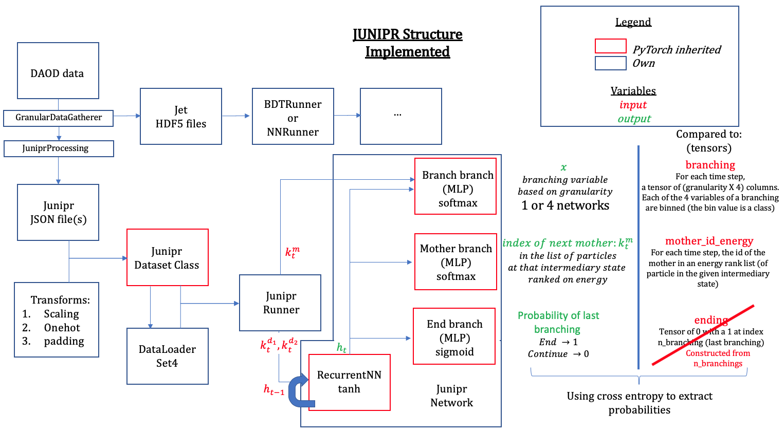
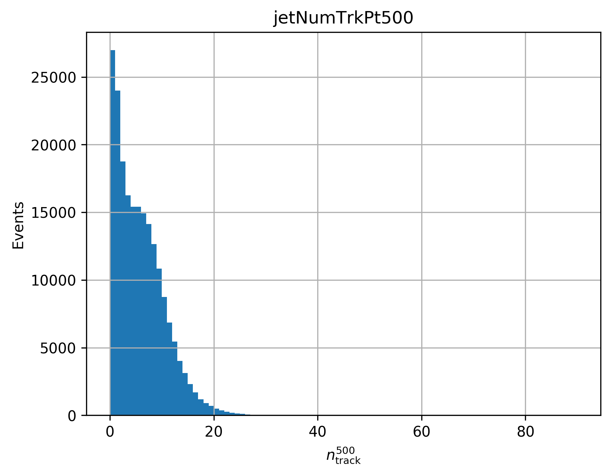
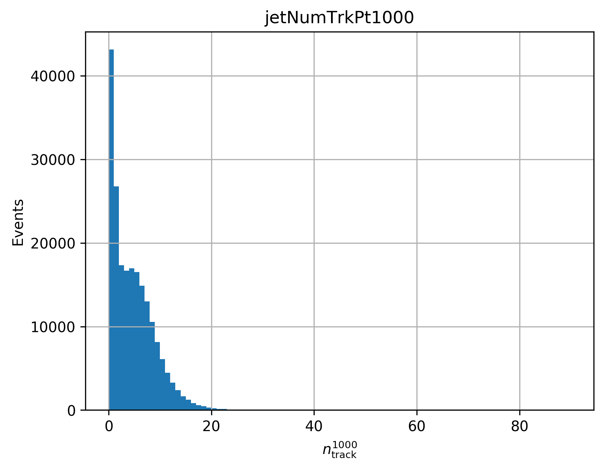
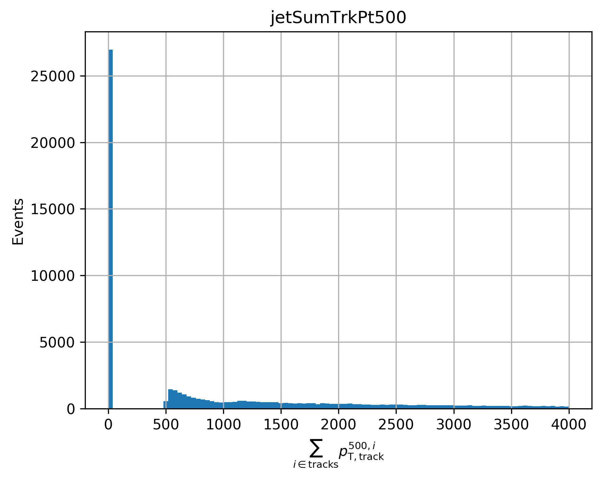
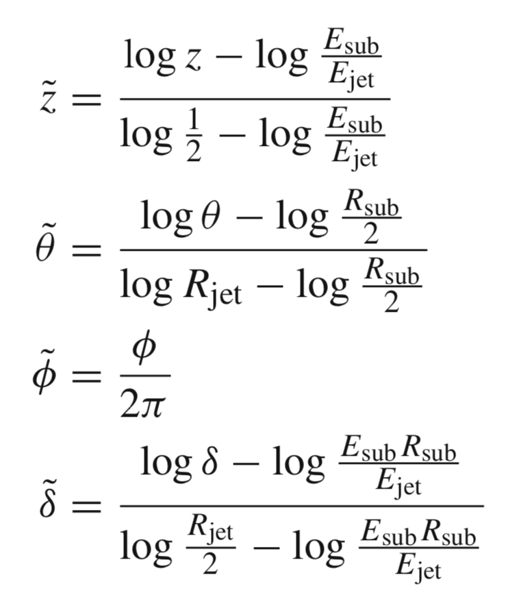

# Quark-Gluon Tagging with Machine Learning - ATLAS Experiment
## Meetings
### Recent progress: 

* Finished implementing the JUNIPR network:
    * The data can now pass through all components in batch form (this is preferable to one-event at a time for optimality reasons). Sole weakness: computing the loss. This is due to each event having a different sequence length (a sequence in this case is the number of node in the tree, each node being fed to the recurrent network sequentially). For the loss module, the computed value therefore have to be restrained to the real sequence length and not the padded one. If, in testing time, the implementation proves too slow, I could explore a batch-friendly implementation of the loss (using mask on indices matching padded values as observed from the target info).
    
    

    
    

    * Modified slightly the structure compared to last week. In particular: 
        * no need for one-hot encoding of branching info. Instead, each bin is now seen as a class and the cross-entropy naturally implements the probability reduction.
        * no need for data input on end sequence (0 for going on, 1 for stopping). This is directly deduced from the number of branching (this reduces the size of batch)
        * implemented 2 factorisations of branching:
        * a first one sees the branching  network as a single MLP going to 4 * <i>granularity</i> (z, t, p and d deduced from single MLP) with input info being hidden + mother momenta
        * a second one sees the branching network as 4 MLP's. A first one outputs <i>granularity</i> values to deduce z from hidden + mother momenta. Another networks outputs t (<i>granularity</i> outputs) using hidden + mother momenta + <b>z info (from input)</b>. Similarly, for d using hidden + mother momenta + <b>z  + t info from inputs</b> and for p using hidden + mother momenta + <b>z + t  +d info from inputs</b>

* Currently running the different data processing programs on samples of DAOD_JETM6 and DAOD_JETM8. The M6 have ttbar info and M8 have the dijet and Z+jet. A minor issue oberved is that M8 does not have the sort of jet I'm currently using ("AntiKt4EMTopoJets") and the only common ones with M6 are "AntiKt4EMPFlowJets" and "AntiKt4TruthJets". Options are either to change to sort of jet studied (so that data is processed similarly for each label and spurious differences are introduced) or gather data from different distributions (such as M7). Note that M6 is currently being modified so not all data files were accessible previously (this seems to be the origin of the failure of the grid processing). The issue migth have been solved in the meantime. I'll see with Aaron what we can get. 
    
    * Yesterday I finished processing another ttbar file from the DAOD_JETM8 family. It showed something strange in the jet variables (after cuts removing jet with pT < 20 GeV and less than 5 constituents). Below is a histogram of the number of track with a pT of at least 500 (left) and 1000 (right) for each jet (NumTrkPt500 and NumTrkPt1000). 
    
    

    
    
    

        
    * And following is a histogram of jet with  a summed of track pT of at least 500 (SumTrkPt500).
    
    

    
    

    
    * These variable seem to suggest a strange peak at 0. I have no idea if this is to be expected or should be removed.
    
* Next steps:
    * implementing a way to visualise the probability on a tree structure (as done in Junipr paper),
    * training the model on large datasets (in progress, seems to work fine for the moment),
    * optimising the structure,
    * train on same dataset the BDT and NN,
    * compare models
    * possibly: quickly go through the steps of a particle flow network (simpler to implement, it takes the final constituents as an unordered list and output a graph with a complex convolution operations implemented through NN's). This model was also shown to be state of the art for a different jet task. 

* Note: I still have an annoying issue with the scaling of data. Since jets here are not restrained to an energy-radius window, the data lacks a natural scaling. I implemented somethign supposedly quite general to bring most of the data into the range [0, 1]. This works well for most data but about 4% of branchings fall out of the window and are therefore trimmed to 0 or 1. This is not dramatic since later on the branching data is discretised into 10 (for now) bins so in any case it would fall in their assigned bins. I am however afraid that this might blur out some information. The scaling functions are (for now too) taken directly from Junipr: 

[Notes on meetings.](https://docs.google.com/document/d/1mPCNGwLqUHwPWRzEXwxDVAvANspSMXEBrSzKO49E8Ds/edit?usp=sharing)

## Readings
[Temporary bibliography.](https://docs.google.com/document/d/1T0P84bvZvcEdx9cvs6z_uXsKWNDNlzjyWbvqWfU1s5I/edit)

[Note on Readings.](https://docs.google.com/document/d/1u7orIhStgtNy6GY1Ix_eOC2UjRiMTey7CkkDW5u7Oxg/edit?usp=sharing)

## Work
[Notes on Work Progress.](https://docs.google.com/document/d/1REFWLDmTNmnLVJMIwqeWt13o8EeNrBTAoQybtgy6I2A/edit?usp=sharing)

[Experiment Log.](https://docs.google.com/spreadsheets/d/1Yu8Fxa3OA3b5M0SDpXkCFffr_e0Qvg-HA2QqpyZvl-I/edit?usp=sharing)

PyTorch should be appropriate to implement all considered network implementations and exploit GPU's. In particular:
* Convolutional Neural Network ([CNN](https://pytorch.org/tutorials/beginner/blitz/cifar10_tutorial.html))
* Recurrent Neural Network ([RNN](https://pytorch.org/tutorials/intermediate/char_rnn_classification_tutorial.html))
* Variational Autoencoders ([VAE](https://pyro.ai/examples/vae.html))
* Generative Adversarial Networks ([GAN](https://pytorch.org/tutorials/beginner/dcgan_faces_tutorial.html))

A larger list of tutorials for [PyTorch](https://pytorch.org/tutorials/). 

A general tutorial on EventLoop is accessible [here](https://twiki.cern.ch/twiki/bin/viewauth/AtlasProtected/EventLoop#Grid_Driver) but requires a CERN account.

A tutorial on how to use Athena and the ATLAS codebase to analyse the xAOD files can be found [here](https://atlassoftwaredocs.web.cern.ch/ABtutorial/alg_basic_intro/).

An ATLAS dataset browser is available here [AMI](https://ami.in2p3.fr) and requries a CERN account as well as some certificates. 

A short explanation on variables is available [here](https://twiki.cern.ch/twiki/bin/viewauth/AtlasProtected/Run2JetMoments) but requires a TWIKI access. 

The JUNIPR framework is implemented on [this github page](https://github.com/andersjohanandreassen/JUNIPR)
