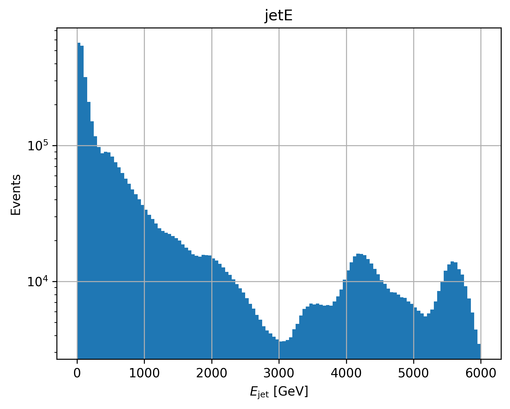
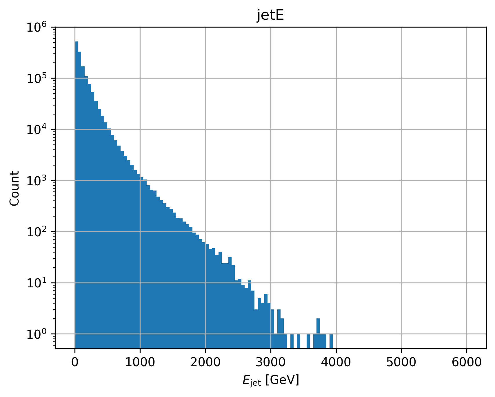
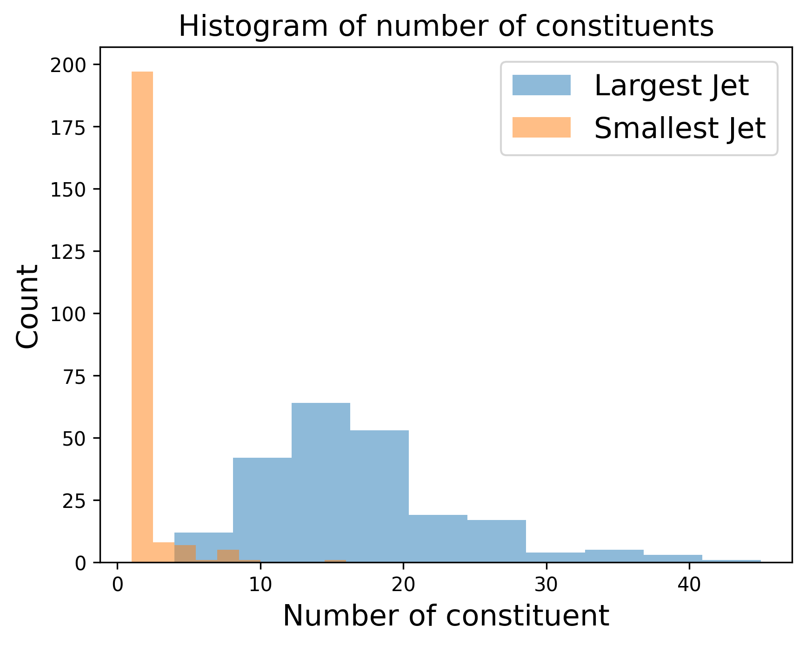
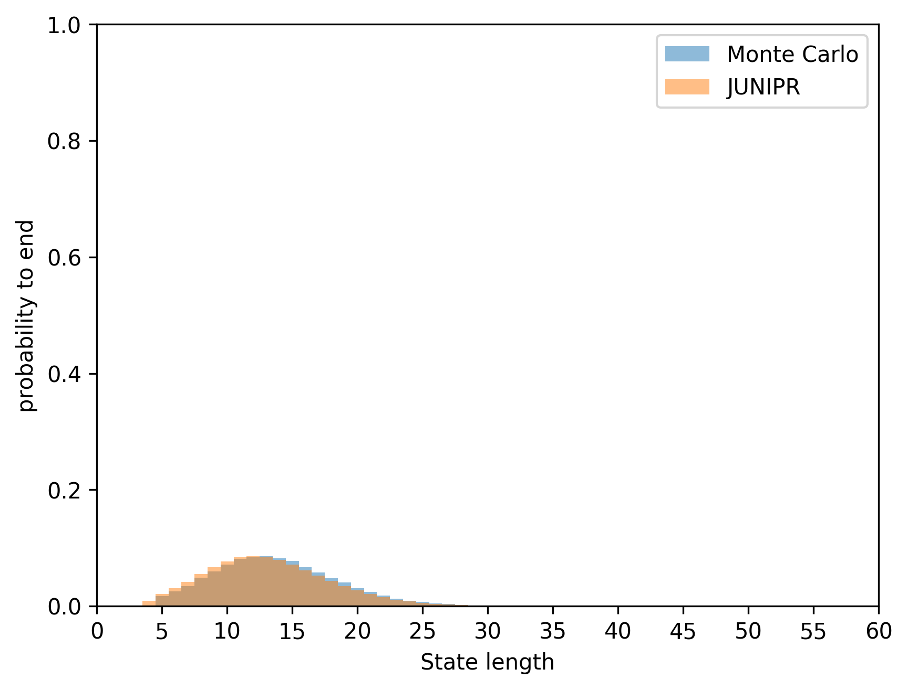
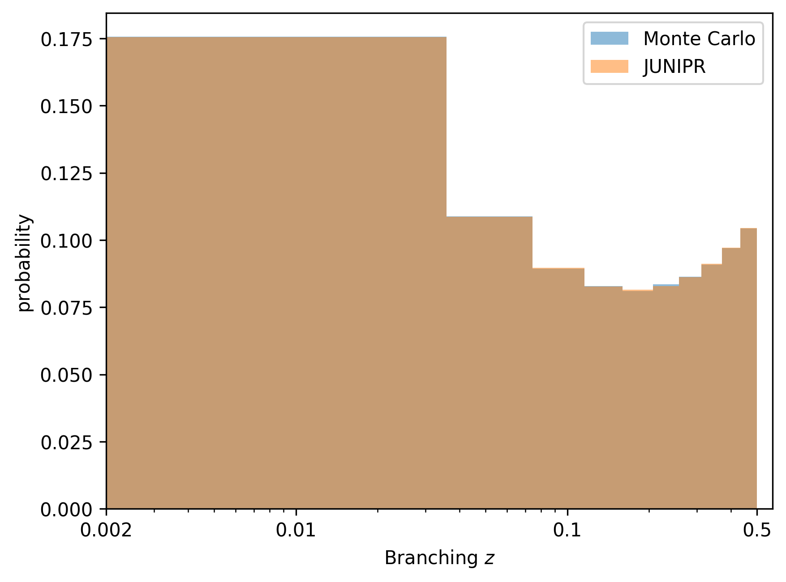
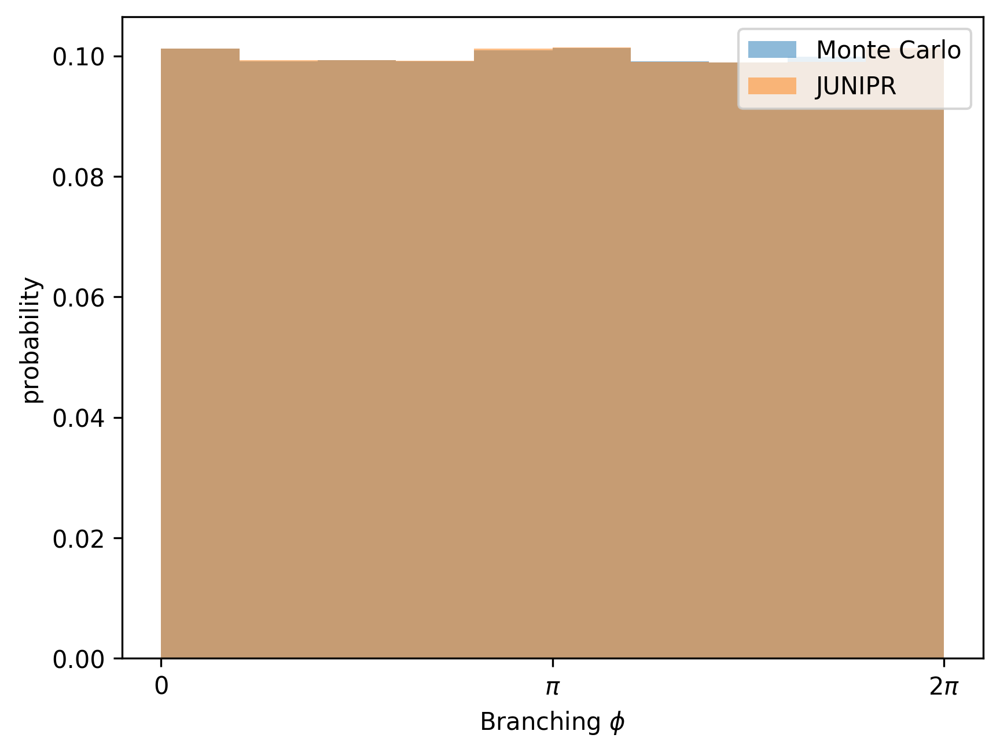
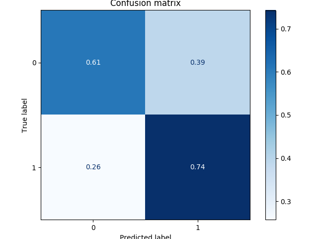
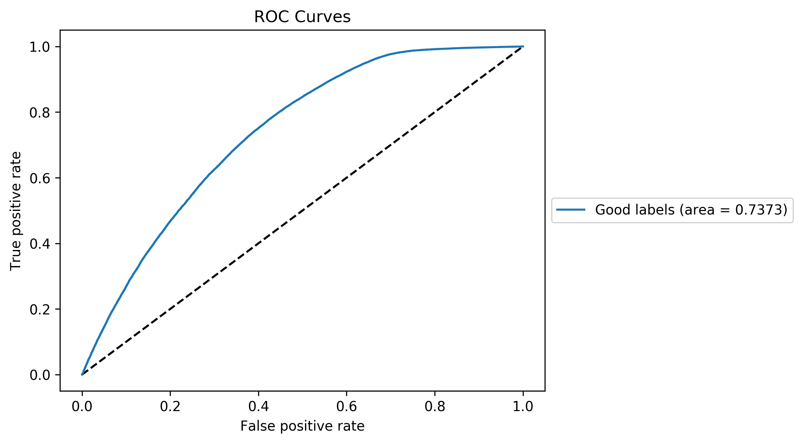

# Quark-Gluon Tagging with Machine Learning - ATLAS Experiment
## Meetings
### Recent progress: 
* You will find a very rough draft for the dissertation structure in Proposed_Structure_Dissertation.pdf. 

* I have corrected a final MAJOR bug in my implementation: I realise I was feeding the wrong information at each node of the recurrence. For node <i>t</i>, the input is the daughters <b>entering</b> the node, which are labelled as being from step <i>t</i>. So, at the start of the recurrence step <i>t</i>, the model uses the daughter labelled as being from <i>t</i>. The problem is that in the JUNIPR paper they label things as starting from <i>t</i> = 1. But there are no daughters initially (the very first node replace the hidden state produce from recurrence on the daughters by an MLP transformation of the seed momentum). So there is a mismatch in the list of daughters and mothers: the first mother (index 0) is the mother of step 1 and the very first daughters (index 0) are the daughters of step 2 (NOT 1). I was not moving these elements in such a way and this led to an observable mismatch in probability distributions (see down). Another issue: the ending branch had a wrong connexion for the very last node. 

* I have spent a lot of time making the network more efficient. This demanded a lot of exploration. 
    * I turned all my losses in batch form. It has barely any advantage for the start of training (the batch size of 10 is not sufficient to see the effect arising) but it massively speeds things up for larger batch (up to 8 times faster). 
    * To do this efficiently, I had to use masking tensors and therefore slightly increased the input data. I realised that the time to load a batch was  significant (particularly for small batches, as it took more time to load a batch than to compute the loss). I therefore explored some options to perform this faster and am starting to use parallel workers for preparing batch (so that batch preparation is no longer an issue). Problem is that python refuses to have // access to the same list without copying the data which generated a massive data leaked that killed most of my job on Condor (this was weirdly not an issue on pplxint). I countered that issue by wrapping the list in a manager.list() from multiprocessing which seemed to do the trick (no more data leak) but somehow Condor does not like this after a while and abruptly kills the job. i do not know as of know where the issue comes from. If I cannot solve it, it is not so detrimental to run with // batch processing (increases on slightly the time). 
 
 * I have downloaded many new samples of dijet and ttbar and finished processing the JUNIPR dataset in its final version, which first removes constituent of jets with less than 1 GeV and than has the following cuts on jets having: less than 5 constituents (of at least 1 GeV) or a pT below 20 GeV or a jet not coming from the primary vertex. The constituent cut is new and inspired by the idea to keep a conservative tree that does not display small radiations (it removes a lot of noise from the data). The dataset hence filtered contains about 1.8 M jets (precisely 1,748, 886 jets) from both types (I called such datasets "matched"). This is the result of a scaling function to cut down the gluon jets from the dijet samples into a way that makes them have the exact same energy distribution as the quark jets from the ttbar. I believe this is the easiest way of making the distribution truly energy independent (Aaron did not seem to have found a different solution). Currently, the dijet energy distribution of jets looks like this the left plot (in log scale). The right plot is the outcome after scaling to ttbar (perfect agreement). 
 
    

    
    
    

    
    This is a histogram listing the size of the largest and smallest jets reconstructed by C/A with radius 0.5 from a single original jet (reconstructed with anti-kT and radius = 0.4). Note that the cut on constituent of 1 GeV surely plays a role now. 
    

    
    

    
    histogram_number_constituents
    
    
    * As mentioned several times, I am now matching the ttbar quark samples to the dijet gluon samples. It means I am actively isolating quark from the ttbar and gluon from dijet. I am doing this as the tasked of weak supervision is more difficult (the signals suffer from a lot of pollution: about a third to a fourth of the jets in a dataset are from the other label) and I would like to compare the result to the JUNIPR ones (I am already generalising quite a bit by using calo cells instead of actual particles and not restraining in energy). It would also be unfair to compare the discriminative output of a weakly trained algorithm to a fully supervised one (their job is far easier). The weak supervision context would of course be something interesting to study if more time was available. 
    
    * I have trained unary models with the bugs of last week fixed (but still containing the bug of this week) and finished training a unary model for quark with the bug uncovered this week fixed.  It's an interesting situation that amounts to asking: can you understand (derive a correct likelihood model) a jet based on an internal information based on the daughter produced by the node rather than by the pair of daughters (with one of them being the mother) generating the node. Interesting to compare the probability distributions learnt. There is also an added difficulty to model the probability for the tree to end (last ending). On the left it is the probability distributions learnt by the model with a bug and on the right the new one that should be fixed. 
        * Probability for a jet to end after given number of nodes: 
        

        
        
        

        Note the slight disagreement for the old model (left) due to the wrong implementation. The new model does not exhibit this. 
         
         * Probability for a mother to be the next one to decay in an energy-ordered list of particles existing at the given timestep: 
         

         
         
         

         
         * Probability distribution of the z-branch: 
         

         
         
         

         This will be modified in the new dataset since constituents with less than 1 GeV are now removed. 
         
         * Probability distribution of the theta-branch: 
         

         
         
         

         I maybe should adapt the scaling to avoid empty bins. Problem is that it might reduce sensitivity in the important range (or will lead to discontinuous scaling).
         
         * Probability distribution of the phi-branch: 
         

         
         
         

         The one where the new model shows the most error. This is quite normal as the phi distribution is in fact quite free (all phi values should be as likely))
         
         * Probability distribution of the delta-branch: 
         

         
         
         

         I maybe should adapt the scaling to avoid empty bins. 
         
* I have trained a binary model with the bug of this week in. The model used the matched dataset (equal number of pure labels of quark and gluon from ttbar and dijet respectively, with 762,656 jets in total for training, 38,142 for validation (used during training to assess the performance), and152,574 for the test at the end. The performance is already dramatically better than before (which had an AUC of 0.624) and this is still a wrongly implemented model !!! The accuracy obtained (by simply rounding) was 0.675 with a confusion matrix is displayed left (right is the ROC curve):

    

    
    
    

* To push things further, I will be running the last implementation of the model on the hugely extended dataset (final version). To help with this process, I am considering moving to a GPU on the ARC. It is indeed quite difficult to train on Condor as this is highly unstable (jobs get killed because of the weather in the UK for example), communicates extremely poorly (no error log), and seems very bad at parallel processing (only CPU's and the num_worker seems to be something that likes to crash on Condor). I have the not so little issue that currently the whole dataset must be kept in memory (it's going to be of about 25 GeV so it works on Condor) but I believe I can cut this into chunks and ask PyTorch to load a chunk and store it as long as it needs to (might require some significant adaption). It might be possible to require as much memory on the ARC too in which case this is not really an issue (I would of course only move to the GPU a processed batch, not the whole dataset).

* I am going to be collecting the h5 dataset and run the NN on it (and, if time permits, the BDT. Training the NN is safer as I have access to the training loop while the BDT does it alone with fit). 

[Notes on meetings.](https://docs.google.com/document/d/1mPCNGwLqUHwPWRzEXwxDVAvANspSMXEBrSzKO49E8Ds/edit?usp=sharing)

## Readings
[Temporary bibliography.](https://docs.google.com/document/d/1T0P84bvZvcEdx9cvs6z_uXsKWNDNlzjyWbvqWfU1s5I/edit)

[Note on Readings.](https://docs.google.com/document/d/1u7orIhStgtNy6GY1Ix_eOC2UjRiMTey7CkkDW5u7Oxg/edit?usp=sharing)

## Work
[Notes on Work Progress.](https://docs.google.com/document/d/1REFWLDmTNmnLVJMIwqeWt13o8EeNrBTAoQybtgy6I2A/edit?usp=sharing)

[Experiment Log.](https://docs.google.com/spreadsheets/d/1Yu8Fxa3OA3b5M0SDpXkCFffr_e0Qvg-HA2QqpyZvl-I/edit?usp=sharing)

PyTorch should be appropriate to implement all considered network implementations and exploit GPU's. In particular:
* Convolutional Neural Network ([CNN](https://pytorch.org/tutorials/beginner/blitz/cifar10_tutorial.html))
* Recurrent Neural Network ([RNN](https://pytorch.org/tutorials/intermediate/char_rnn_classification_tutorial.html))
* Variational Autoencoders ([VAE](https://pyro.ai/examples/vae.html))
* Generative Adversarial Networks ([GAN](https://pytorch.org/tutorials/beginner/dcgan_faces_tutorial.html))

A larger list of tutorials for [PyTorch](https://pytorch.org/tutorials/). 

A general tutorial on EventLoop is accessible [here](https://twiki.cern.ch/twiki/bin/viewauth/AtlasProtected/EventLoop#Grid_Driver) but requires a CERN account.

A tutorial on how to use Athena and the ATLAS codebase to analyse the xAOD files can be found [here](https://atlassoftwaredocs.web.cern.ch/ABtutorial/alg_basic_intro/).

An ATLAS dataset browser is available here [AMI](https://ami.in2p3.fr) and requries a CERN account as well as some certificates. 

A short explanation on variables is available [here](https://twiki.cern.ch/twiki/bin/viewauth/AtlasProtected/Run2JetMoments) but requires a TWIKI access. 

The [JUNIPR framework](https://arxiv.org/abs/1804.09720) is implemented on [this github page](https://github.com/andersjohanandreassen/JUNIPR)

