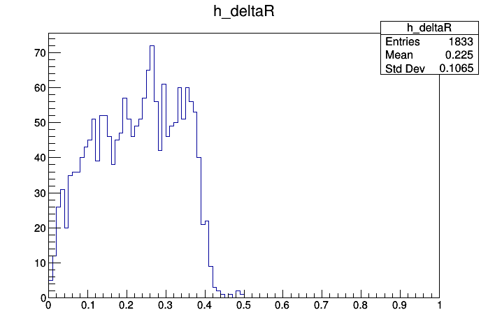

# Quark-Gluon Tagging with Machine Learning - ATLAS Experiment
## Meetings
### Recent progress: 
* Spent the 6 days working on the Granular Data Gatherer. Several elements were implemented:
    * Retrieving jet constituents of variables: pT, eta, phi, energy, mass, and \delta R. 
    * Storage in a TTree to be used with UpRoot later one
    * Had a small issue on indexing constituents to the RunNumber, EventNumber, JetNumber. The last one is a counter of the number of jets in a given RunNumber, EventNumber. These three indexes therefore form a key uniquely identifying each event for a given datafile. 
    * Had a check of the data and plotted the \delta R histogram. The result, shown below, is consistent with the jet target: AntiKt4EMTopoJets.  
    
    

    
    

    
    * I wrote a test loader on the output of the algorithm for constituent information: managed to obtain a panda dataframe of expected structure.
    
    * Worked on gathering global jet variables: in fact almost the same list of variables as used before:
        * 'jetPt', 'jetEta', 'jetPhi', 'jetMass', 'jetEnergy', 'jetEMFrac',  'jetNumTrkPt500', 'jetNumTrkPt1000', 'jetTrackWidthPt500', 'jetTrackWidthPt1000', 'jetSumTrkPt500', 'jetSumTrkPt1000', 'jetEMFrac', 'jetHECFrac'.
        * Only one not gathered for now is:  'jetChFrac'.
        * For the jetXPt500/1000: I was surprised to discover they each returned vectors of 19 entries (irrespective of the number of jet). Scavenging through one of Aaron's code, I realised it should be addressed with a specific element: pvIndex. Retrieving that element proved a bit of a mess: I am using EventLoop formalism and the access method I copied from Aaron, according to him, couldn't work with this addressing. 
    * Another issue we faced was regarding quark-gluon truth information. Going through his code, I realise it shouldn't be that hard to implement for this case. This would increase the quality of the final analysis (with a discussion on the precision of weak supervision). The problem was that it uses some specific tools that need to be properly loaded into the algorithm. Once again, the difference of formalism generated some weird bug.
    * I am working with Aaron to resolve these issues. It is quite hard to debug because the error messages we get offers very little information (an error in the algorithm seems to mostly only return an error regarding the driver.submit command).
    
    * I started focusing on running jobs on the grid. I followed every step from the Atlas tutorial to get access and installed everything as required. This should be properly set up now. I wrote a test steering macro (using SH::scanRucio for file access and PrunDriver driver). I also found a way to search what data is available on the grid (using a browser to access Ami). 
        * There is a problem in the processing of the data (the error message is displayed below). The algorithm does work locally (local driver + local data) but not on the GRID. I tried several things to debug it:
            * Change the driver to the local one DirectDriver: that was interesting because it showed the processing, after loading the data using RUCIO (so even grid data was read locally indicating that aspect works) actually starts: a few events are processed before a failure occurs. The end of the error message is the same one as the simple grid job => assume it is the same problem. 
            * Given this result, I wondered if this was due to the nature of the data I processed: a data file (not simulated). I changed the target and obtained the same result on grid processing. Notable difference: I received emails explaining job failed for all data ones but not for the MC ones.
            * I discussed this problem with Aaron and we spent an hour yesterday trying to understand it. Right now we have no idea what is going wrong. He mentionned he has also had some weird bugs on routines that should work and that there might be something "fishy" with the grid for the moment. 
            
    * Following these (frustrating) bugs, Aaron proposed to debug the Gathering code while I focus on the next stage of processing. I will run the (working version of the) algorithm locally on the available data to gather a subset to process into the (dreamt) trees. 
                

#### First error message for GRID job on Grid. 
"""
TypeError: bool TObject::IsEqual(const TObject* obj) =>
could not convert argument 1
Traceback (most recent call last):
File "../source/MyAnalysis/share/ATestSubmit.py", line 45, in <module>
driver.submit( job, options.submission_dir )
TypeError: none of the 2 overloaded methods succeeded. Full details:
void EL::Driver::submit(const EL::Job& job, const string& location) =>
basic_string::_M_construct null not valid (C++ exception of type logic_error)
void EL::Driver::submit(const EL::Job& job, const string& location, string& actualLocation) =>
takes at least 3 arguments (2 given)
"""

#### Second error message for GRID job run locally with grid data accessed with Rucio. 
"""
xAOD::TEvent::getInput... WARNING Key 0x386a6769 unknown
xAOD::TVirtualEvent::r... WARNING Couldn't retrieve 10DataVectorIN4xAOD9IParticleEN16DataModel_detail6NoBaseEE/0x386a6769
Package.EventLoop        ERROR   /build/atnight/localbuilds/nightlies/21.2/athena/PhysicsAnalysis/D3PDTools/EventLoop/Root/MessageCheck.cxx:35 (void EL::Detail::report_exception()): caught exception: ElementLink::operator*() Element not available
Package.EventLoop        ERROR   
....
TypeError: bool TObject::IsEqual(const TObject* obj) =>
could not convert argument 1
Traceback (most recent call last):
File "../source/MyAnalysis/share/ATestSubmit.py", line 45, in <module>
driver.submit( job, options.submission_dir )
TypeError: none of the 2 overloaded methods succeeded. Full details:
void EL::Driver::submit(const EL::Job& job, const string& location) =>
basic_string::_M_construct null not valid (C++ exception of type logic_error)
void EL::Driver::submit(const EL::Job& job, const string& location, string& actualLocation) =>
takes at least 3 arguments (2 given)
"""

[Notes on meetings.](https://docs.google.com/document/d/1mPCNGwLqUHwPWRzEXwxDVAvANspSMXEBrSzKO49E8Ds/edit?usp=sharing)

## Readings
[Temporary bibliography.](https://docs.google.com/document/d/1T0P84bvZvcEdx9cvs6z_uXsKWNDNlzjyWbvqWfU1s5I/edit)

[Note on Readings.](https://docs.google.com/document/d/1u7orIhStgtNy6GY1Ix_eOC2UjRiMTey7CkkDW5u7Oxg/edit?usp=sharing)

## Work
[Notes on Work Progress.](https://docs.google.com/document/d/1REFWLDmTNmnLVJMIwqeWt13o8EeNrBTAoQybtgy6I2A/edit?usp=sharing)

[Experiment Log.](https://docs.google.com/spreadsheets/d/1Yu8Fxa3OA3b5M0SDpXkCFffr_e0Qvg-HA2QqpyZvl-I/edit?usp=sharing)

PyTorch should be appropriate to implement all considered network implementations and exploit GPU's. In particular:
* Convolutional Neural Network ([CNN](https://pytorch.org/tutorials/beginner/blitz/cifar10_tutorial.html))
* Recurrent Neural Network ([RNN](https://pytorch.org/tutorials/intermediate/char_rnn_classification_tutorial.html)
* Variational Autoencoders ([VAE](https://pyro.ai/examples/vae.html))
* Generative Adversarial Networks ([GAN](https://pytorch.org/tutorials/beginner/dcgan_faces_tutorial.html))

A larger list of tutorials for [PyTorch](https://pytorch.org/tutorials/). 

A general tutorial on EventLoop is accessible [here](https://twiki.cern.ch/twiki/bin/viewauth/AtlasProtected/EventLoop#Grid_Driver) but requires a CERN account.

A tutorial on how to use Athena and the ATLAS codebase to analyse the xAOD files can be found [here](https://atlassoftwaredocs.web.cern.ch/ABtutorial/alg_basic_intro/).

A short explanation on variables is available [here](https://twiki.cern.ch/twiki/bin/viewauth/AtlasProtected/Run2JetMoments)but requires a TWIKI access. 
