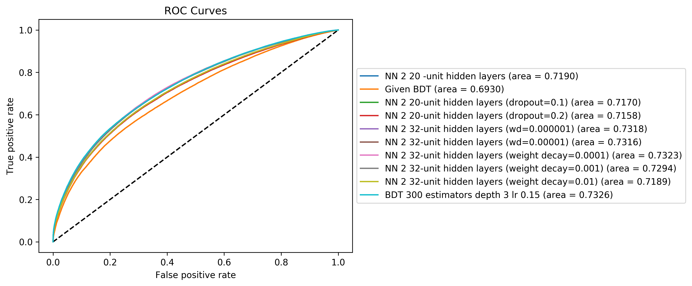
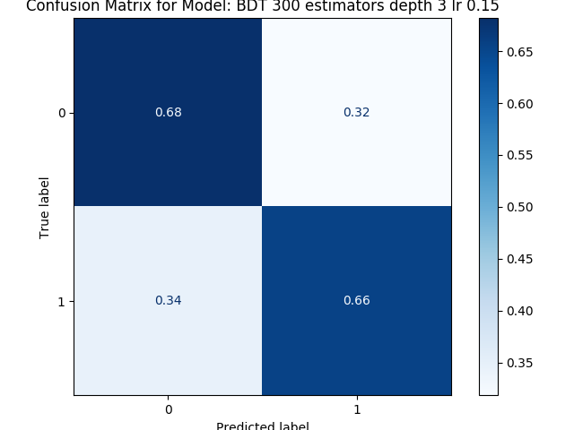
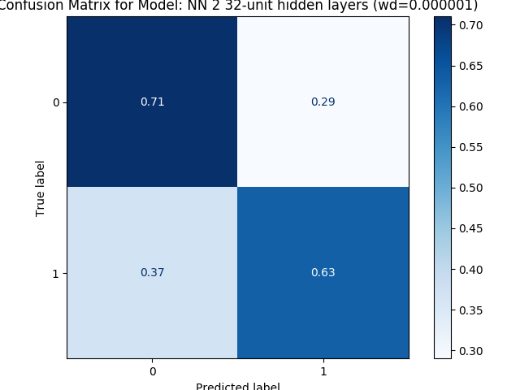

# Quark-Gluon Tagging with Machine Learning - ATLAS Experiment
## Meetings
### Recent progress: 
* Finished implementing a Neural Network runner (NNrunner).
    * Optimised it.
    * Tensorboard implementation with server running.

* Implemented a train-validation-test separator with some data quality checks. (In DataLoaders)

* Reprocessed the dataset set2 into a set3  (identical structure, some data was however missing as I found out in the previous step + some were incorrect, missing an r-tag). Store on server

* Implemented intelligent loader (in DataSet2_loader):
    * based on cross-section: problem here: the cross section of some process is incredibly small compared to other processes. For example user.aoneill.202004281.mc16.361032.Py8EG_N23LO_jetjet_JZ12W.SUSY4.e3668_s3126_s3136_r9364_r9315_p3652_NTUP has a relative cross section of 6.4088763234695515e-18 ... to compare to /user.aoneill.202004281.mc16.361023.Py8EG_N23LO_jetjet_JZ3W.SUSY4.e3668_s3126_r9364_r9315_p3652_NTUP that accounts for almost 90 % of it ! So the sampler follows this relative cross section with at least one event for each signal. This means a vast majority of processes no longer contribute (only 8-9 of them had enough importance to be sampled more than once). This discrepancy may explain why the given BDT performs less efficiently than the self-trained one. 
    * working on other ones based on energy and specific file.

* Trained a variety of models and compared them.  
    * Weird bug from Condor: for the NN family, it does not return some of the output file from the code nor the error and output files from the submission. No error is observed however (tensorboard shows result to the end) and everything is produced as expected when running on ppxint. I saved all trained models. 
    * A ROC curve comparison follows (mostly unreadable as performance seems to be equivalent across models), as shown below. All models beat the given BDT (since no cross section weight here). Own BDT and NN with weight decay = 0.000001 and [14, 32, 32, 1] (structure: 14 inputs to 2 32-unit hidden layers to a final one with sigmoid) and dropout probability of first layer at 0.1 seem to win.
    

     
    

    
    * Weird observation: performance for BDT is uniform over labels (below left), but for NN gluons are systematically better reconstructed (observed from confusion matrix, one is deplayed here, right side).

 

Both have run on Set3 with 1% of the test data (20% of whole data). 

* Granular data: very problematic situation
    * I spent the entire week familiarising myself with ATLAS software and Athena. I read several rubrics, did the entire tutorial (on the event loop formalism) and read every single one of Aaron's athena code. Very hard to quickly implement something complete as the number of variables is significant, finding information and examples complicate and the target itself is not clear (to this day, I still do not precisely know where to get the calo info in the DAOD files ... ). And this is even before having run anything on the GRID to collect the whole of the data (only a fraction is on the server).
    * Had a meeting with Aaron on Thursday (he is quite busy at the moment and hasn't had a chance yet to go over the problem though he said he will be looking over this on Thursday). When I asked him how much should be implemented (referring to triggers, quality cuts, tools to reconstruct data, ...), we realised this might be overly complex for me to write myself with the little time available. I sent him a schema of the structure of the data I am hoping to collect to at least have something comparable to the Junipr framework (but at reconstructed level in ATLAS). 
    * I managed to run an Athena code (mix of C++ and python) to gather some of this information (some Jet info such as pT, eta, ... and even some info on particles inside jets such as pT, eta, phi, ...). Problem is that the missing information is much harder to get (truth label on the jet, dsid) and some control on the data should happen. To have something descent from the physics point of view, a lot of data processing is required (and I have no experience whatsoever in this).
    * So we are wondering if we should strategically retreat to the simpler formalism (using reconstructed info to build antiKt factorisation tree in the ATLAS detector and then run along Junipr).

[Notes on meetings.](https://docs.google.com/document/d/1mPCNGwLqUHwPWRzEXwxDVAvANspSMXEBrSzKO49E8Ds/edit?usp=sharing)

## Readings
[Temporary bibliography.](https://docs.google.com/document/d/1T0P84bvZvcEdx9cvs6z_uXsKWNDNlzjyWbvqWfU1s5I/edit)

[Note on Readings.](https://docs.google.com/document/d/1u7orIhStgtNy6GY1Ix_eOC2UjRiMTey7CkkDW5u7Oxg/edit?usp=sharing)

## Work
[Notes on Work Progress.](https://docs.google.com/document/d/1REFWLDmTNmnLVJMIwqeWt13o8EeNrBTAoQybtgy6I2A/edit?usp=sharing)

[Experiment Log.](https://docs.google.com/spreadsheets/d/1Yu8Fxa3OA3b5M0SDpXkCFffr_e0Qvg-HA2QqpyZvl-I/edit?usp=sharing)

PyTorch should be appropriate to implement all considered network implementations and exploit GPU's. In particular:
* Convolutional Neural Network ([CNN](https://pytorch.org/tutorials/beginner/blitz/cifar10_tutorial.html))
* Recurrent Neural Network ([RNN](https://pytorch.org/tutorials/intermediate/char_rnn_classification_tutorial.html)
* Variational Autoencoders ([VAE](https://pyro.ai/examples/vae.html))
* Generative Adversarial Networks ([GAN](https://pytorch.org/tutorials/beginner/dcgan_faces_tutorial.html))

A larger list of tutorials for [PyTorch](https://pytorch.org/tutorials/). 
