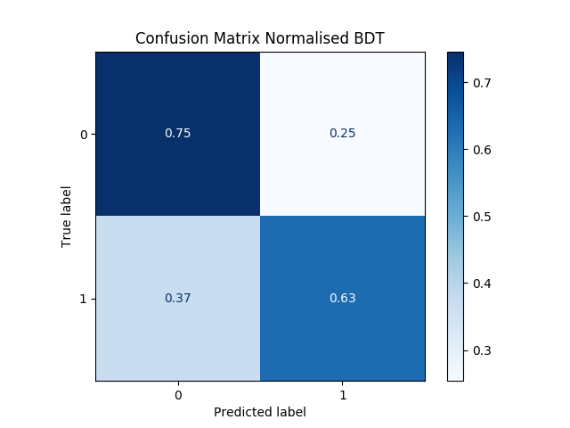
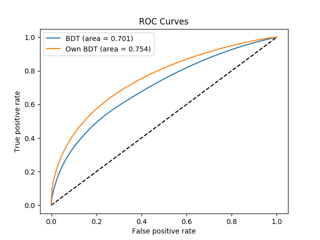

# Quark-Gluon Tagging with Machine Learning - ATLAS Experiment
## Meetings
### Recent progress: 
* Finished training and running the optimisation of the BDT: some statistical results obtained and the model is saved. 

 

* Implemented a neural network model using same variables as the BDT. 
** Worked on new NN runner (Model doc of git) and network.
** Implemented some statistics gathering method to mix its result with the BDT.
** Still need to carry out some hyperparameter optimisation (lots of freedom for the moment) and potentially upgrade the network: only using L2 for the moment. Adding dropout, batchnorm, ... ?
**Implementing some logging, saving and checking tools (such as reporting values to tensorboard) that will be useful when implementing the full model. 
* Worked on an efficient sampler using cross section: access to a dictionary implemented by Aaron using dsid (dataset id) file system. 
*Worked on the new dataset: meeting with Aaron to discuss access to this. Problem is that it does not seem that simple to gather. *What we need appears however quite clearly:
** Three datasets: one with quark-jet rich process, other with gluon rich process. The final one is a jet dataset collecting jet global variable (in order to run the benchmarked model on similar data). Both the quark and gluon tables should have an index pointing to the global jet in the jet table. 
** For each of these jet in the quark-gluon tables (regardless of the type) info required is:
*** Final states particles: their 4-momenta with enough info to get direction and apply anti-kT OR the calorimeter maps + potential tracker info from PFlow. The idea in any case is to build a factorisation tree based on some info: whether this is high-level (4 momenta) or low-level (calo-maps + PFlow) should not modify the model
*** a jet index indicating the jet with it truth information in the jet table (as mentioned above)
*** A notion of pile-up (particularly for the calo-maps: note that a CNN could be deployed to account for this in a first processing layer to build the anti-KT tree). 
*** the energy and “rapidity” of the jet: this is particularly important as the Junipr implementation target a narrow range (500-550 GeV, |y| < 1.5).
*** If several process are stored in the same quark- or gluon-rich dataset: something to distinguish them. 

[Notes on meetings.](https://docs.google.com/document/d/1mPCNGwLqUHwPWRzEXwxDVAvANspSMXEBrSzKO49E8Ds/edit?usp=sharing)

## Readings
[Temporary bibliography.](https://docs.google.com/document/d/1T0P84bvZvcEdx9cvs6z_uXsKWNDNlzjyWbvqWfU1s5I/edit)

[Note on Readings.](https://docs.google.com/document/d/1u7orIhStgtNy6GY1Ix_eOC2UjRiMTey7CkkDW5u7Oxg/edit?usp=sharing)

## Work
[Notes on Work Progress.](https://docs.google.com/document/d/1REFWLDmTNmnLVJMIwqeWt13o8EeNrBTAoQybtgy6I2A/edit?usp=sharing)

PyTorch should be appropriate to implement all considered network implementations and exploit GPU's. In particular:
* Convolutional Neural Network ([CNN](https://pytorch.org/tutorials/beginner/blitz/cifar10_tutorial.html))
* Recurrent Neural Network ([RNN](https://pytorch.org/tutorials/intermediate/char_rnn_classification_tutorial.html)
* Variational Autoencoders ([VAE](https://pyro.ai/examples/vae.html))
* Generative Adversarial Networks ([GAN](https://pytorch.org/tutorials/beginner/dcgan_faces_tutorial.html))

A larger list of tutorials for [PyTorch](https://pytorch.org/tutorials/). 
