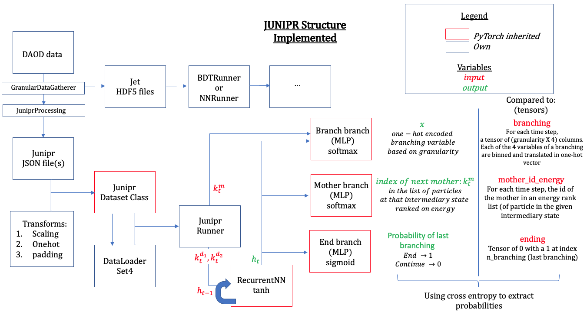
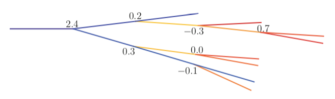
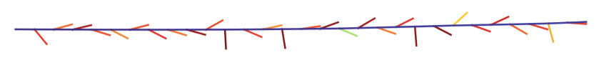

# Quark-Gluon Tagging with Machine Learning - ATLAS Experiment
## Meetings
### Recent progress: 
* I focused solely on setting up the dataloading for a Junipr-like model implemented in PyTorch. Several difficulties are faced:

    * The implementation differs significantly from that of the authors that adopted TensorFlow.Keras (their implementation is available on [this github page](https://github.com/andersjohanandreassen/JUNIPR)). The interest of "re-inventing" this wheel is that PyTorch allows for greater control in the training loop, is more flexible for implementation on GPU's and arguably faster. A significant advantage is that seeding (removing "randomness") is total in PyTorch while Keras could be criticised for leaving randomness in the RNN modules. Finally, a major interest in re-writing the whole structure is that it requires a deep understanding of every element included. 
    
    * The data considered here is intrinsically of various size: jet-trees differ in length. This demands some care in writing batch loaders: dimensions must agree. This is dealt with in two steps:
    
        *  An own class inheriting from PyTorch dataset class, in DataLoaders/JuniprDataset.py, structures all input to look alike. Padding (filling a various size tensor into a larger- and fixed-size tensor of padding values) is used with the real size of each input accessible from multiplicity and n_branching information. The system has been checked to produce batches of expected behaviour.
        
        * A Dataloader_Set4 codebase creates this intelligent dataset, splits it into training/testing and returns two PyTorch dataloaders (for training and testing). These are then retrieved in the JuniprRunner routine (from the Models/ folder) to bring the data to the locally implemented PyTorch-esque model. The running loop of this model will stop the training/evaluating of data_input having reached their end size (so that no padded_value passes through).
        
        * One of the important roles of the JuniprDataset class is to facilitate certain specific operations on the data. Mainly: scaling, padding and "one-hot-vectoring". The first one reduces the amount of global parametric shift required in optimisation, while the other ones perform the aforementioned operation and the task of one-hot encoding (discretise input data into an encoding setting a 1 in a vector of 0's for the index matching the fed data; for example, a depth-two hot encoding of [1, 2] is simply [(1,0), (0,1)]). An issue with the first step is apparent now: since we do not restrain to a specific jet energy window (the author focus on 450-550 GeV jets), the model lacks natural parameters to evenly scale its inputs variables in the range [0, 1]. I adapted the parameter of this scaling to be as general as possible. This is necessary for the one-hot encoding pass after the granular operation (see next point), because no value can be outside of the [0, 1] range for the following encoding step. A safety net is implemented by clipping values outside the range. 
    
    * The need for one-hot encoding and granular transformation concerns the branching information. A branching is parametrised by x = [z, theta, phi, delta], respectively the soft-daughter energy fraction, the soft-daughter to mother angle, the angle of the plane of decay with respect to mother and y-axis of the detector, and the hard-daughter to mother angle. The info is first scaled (using the scaling operation discussed just above) in the range [0,1]. The authors of JUNIPR observed that having a discretised probability distribution over these branching is sufficient for the network to learn. Therefore, possible values of x (living in R^4, r being the set of real numbers) are binned into granularity^4 (each variable in x gets 10 bins). They chose granularity = 10,  meaning for example that x = [0.11, 0.32, 0.21, 0.12] gets discretised to [1, 3, 2, 1]. For computational use, this is then turned into a one-hot vector (so that softmax operation can be used to select each of the 4 component of the binned x). A smaller example of this processing would be, for a variable m = [a, b] and two bins: [0.3, 0.6] -> [0, 1] -> [(1, 0), (0,1)]. Therefore, the encoding of [0.3, 0.6] would simply be 1001 and two softmax (one over the two first values and the other one over the last) would recognise such data. (<i>Note: I am actually moving slightly away from JUNIPR here since they actually one-hot encoded the discretised x values directly, not the discretised components. This means their encoding is of size 10^4 (a vector of 10^4 - 1 nulls with a 1 to indicate which x value it is. The encoding here is of size 10 X 4, significantly smaller. Thansk to PyTorch, implementing several softmax operation on restriction of the output is easily implementable.</i>)
    
* To clarify, the following schema characterises the locally implemented Junipr structure:

* An important weakness that will require great care when analysing the network has been uncovered. It relates to the use of the anti-kT algorithm (over Cambridge-Aachen method or other). Indeed, this jet clustering method does not approximate the natural collinear structure of QCD. The hidden state of the recurrent network has to retain far more information in the case of anti-kT than, for example, C/A. To understand this point, some analysis of the anti-kT algorithm is required. In its process, it recombines to the <b>highest energy </b> final state particle with softer radiations (other final and intermediary (after the first step) states particles). This means that the mother in the anti-kT algorithm is <b>always</b> the most energetic particle at a given step. This has a profound implication on the JUNIPR structure. A whole branch of the model is tasked with predicting the index of the next mother in an energy-based ordered list of particles present at a given step. With anti-kT, this is trivially the first item of such a list for all steps (since the mother is always the most energetic). Such a network would learn an utterly useless mapping, setting the mother prediction to output the first index being right in all instances. The authors have tried this method and still obtained some good results in the task of discrimination (less so when considering generating new jets).The following two jet trees come from the JUNIPR paper and present, on the left side, the output for an A/C algorithm and, on the right side, that for the anti-kT. 

    

    
    
    

    
It is apparent that more information regarding the global jet has to be retained by the network in the anti-kT case (the last branching info offers little information on the global jet behaviour while in the C/A case the specific particle decaying is informative). 
    

[Notes on meetings.](https://docs.google.com/document/d/1mPCNGwLqUHwPWRzEXwxDVAvANspSMXEBrSzKO49E8Ds/edit?usp=sharing)

## Readings
[Temporary bibliography.](https://docs.google.com/document/d/1T0P84bvZvcEdx9cvs6z_uXsKWNDNlzjyWbvqWfU1s5I/edit)

[Note on Readings.](https://docs.google.com/document/d/1u7orIhStgtNy6GY1Ix_eOC2UjRiMTey7CkkDW5u7Oxg/edit?usp=sharing)

## Work
[Notes on Work Progress.](https://docs.google.com/document/d/1REFWLDmTNmnLVJMIwqeWt13o8EeNrBTAoQybtgy6I2A/edit?usp=sharing)

[Experiment Log.](https://docs.google.com/spreadsheets/d/1Yu8Fxa3OA3b5M0SDpXkCFffr_e0Qvg-HA2QqpyZvl-I/edit?usp=sharing)

PyTorch should be appropriate to implement all considered network implementations and exploit GPU's. In particular:
* Convolutional Neural Network ([CNN](https://pytorch.org/tutorials/beginner/blitz/cifar10_tutorial.html))
* Recurrent Neural Network ([RNN](https://pytorch.org/tutorials/intermediate/char_rnn_classification_tutorial.html))
* Variational Autoencoders ([VAE](https://pyro.ai/examples/vae.html))
* Generative Adversarial Networks ([GAN](https://pytorch.org/tutorials/beginner/dcgan_faces_tutorial.html))

A larger list of tutorials for [PyTorch](https://pytorch.org/tutorials/). 

A general tutorial on EventLoop is accessible [here](https://twiki.cern.ch/twiki/bin/viewauth/AtlasProtected/EventLoop#Grid_Driver) but requires a CERN account.

A tutorial on how to use Athena and the ATLAS codebase to analyse the xAOD files can be found [here](https://atlassoftwaredocs.web.cern.ch/ABtutorial/alg_basic_intro/).

An ATLAS dataset browser is available here [AMI](https://ami.in2p3.fr) and requries a CERN account as well as some certificates. 

A short explanation on variables is available [here](https://twiki.cern.ch/twiki/bin/viewauth/AtlasProtected/Run2JetMoments) but requires a TWIKI access. 

The JUNIPR framework is implemented on [this github page](https://github.com/andersjohanandreassen/JUNIPR)
