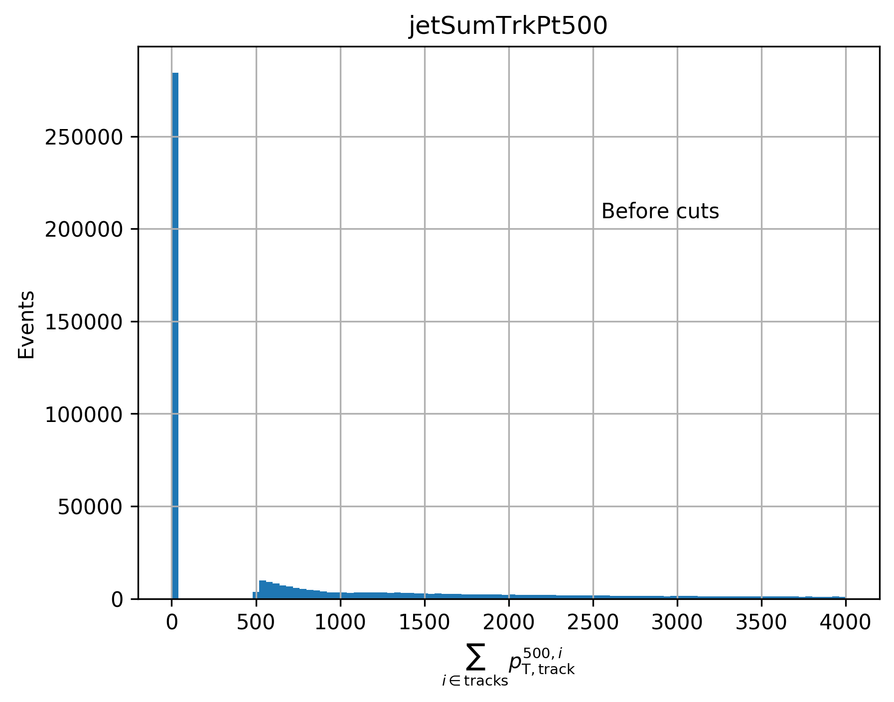
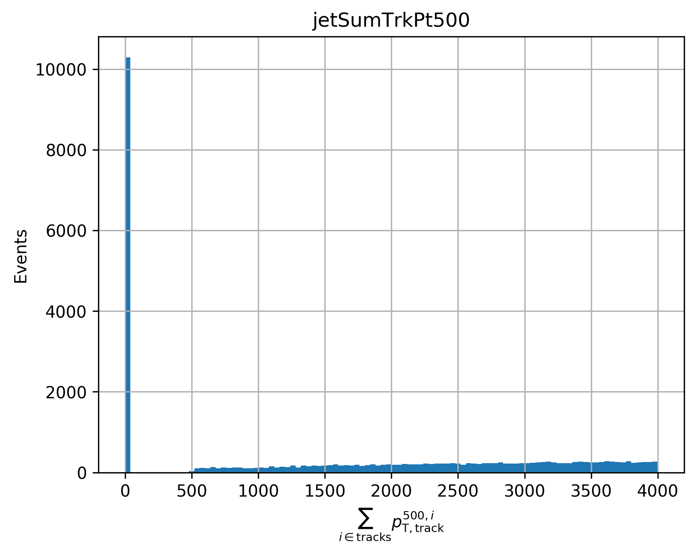
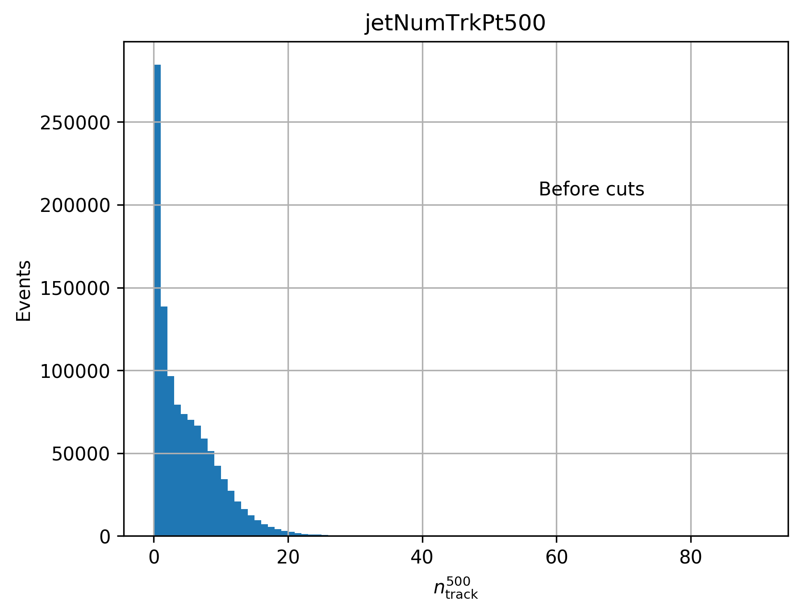
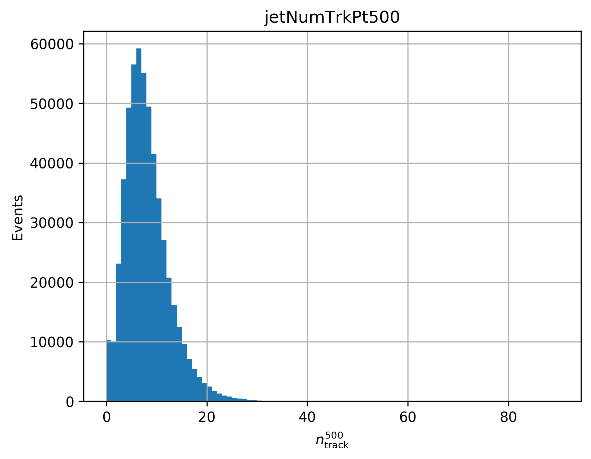
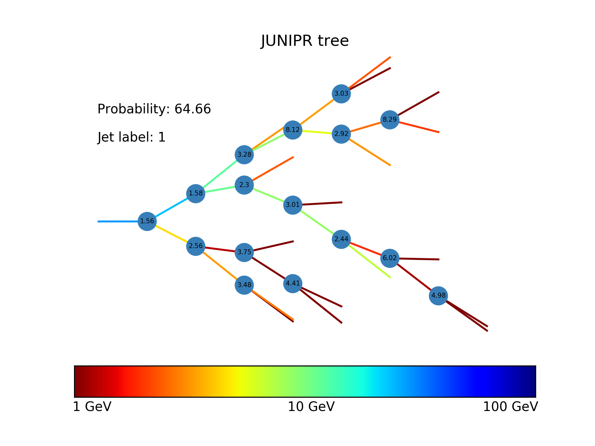
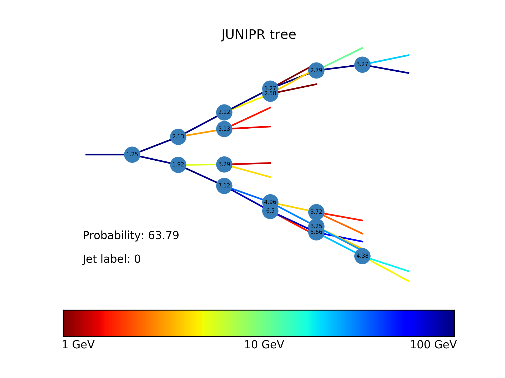
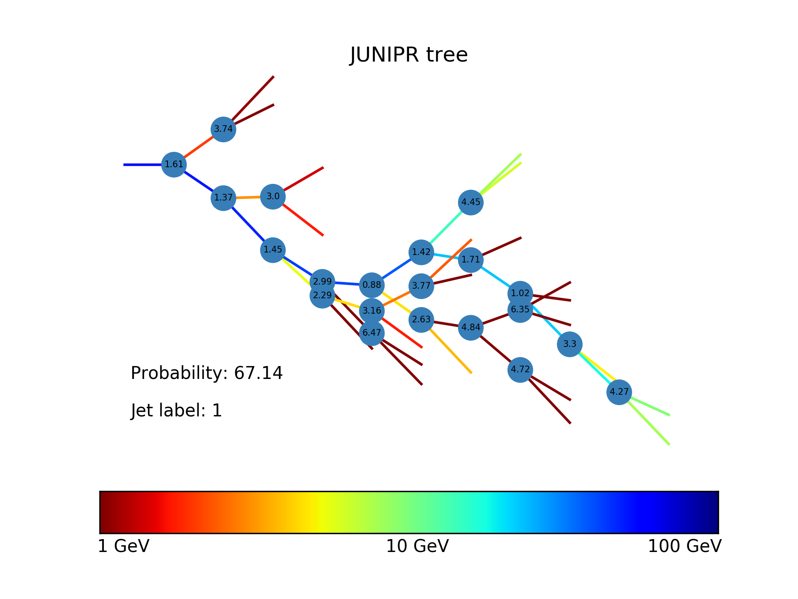
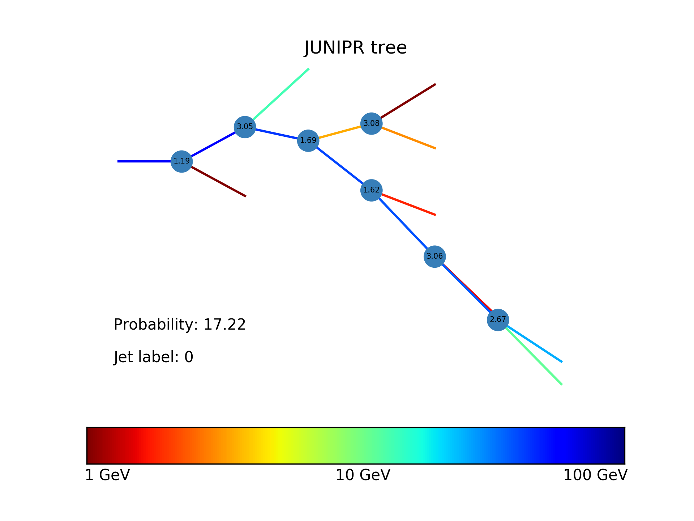
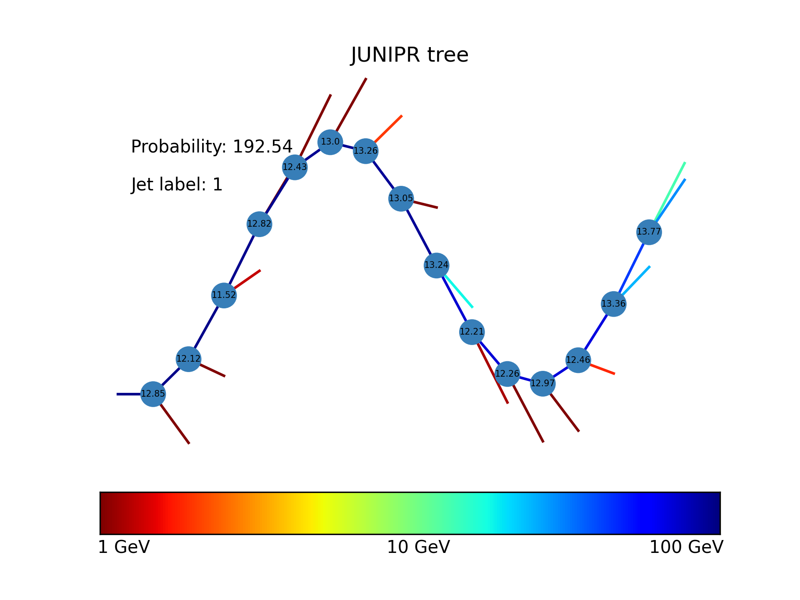
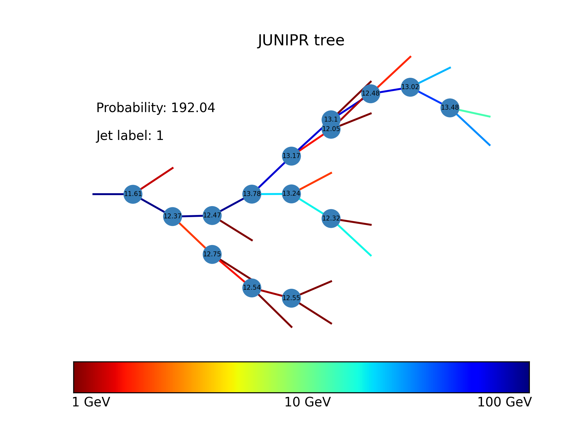

# Quark-Gluon Tagging with Machine Learning - ATLAS Experiment
## Meetings
### Recent progress: 

* Concerning data: I now have access to both quark and gluon data of the same distributions (DAOD_JETM6). Both sets have passed the first processing step (Athena Algortihm) and are being translated into Junipr Jets. This takes some time given how large they are (processing the 916,786 gluon jets is expected to take close to 13 hours for example) and given (for some reason) HTCondor is far less efficient in data transfer than simply using the pplxint. I will be running on this data has it has quark (with ttbar) and gluon (with dijet) samples of comparable information. In particular, it has similar sort of jets and the same r and e tags. 

* Concerning the strange peaks observed last week in  SumTrkPt500 and NumTrkPt500, I added the cut you suggested (removing jets that have a SumTrckPt500 at the PV_index inferior to some SumTrckPt500 at some other indice). The modification observed on the data is as follows for SumTrkPt500 (left is before any cuts, right is after all cuts).

* And for NumTrkPt500:

* I have finished training two Junipr models on quark (previous datasets). One before the added cut on SumPtTrack500 (that we discussed last week to remove spurious peak) and one with (I refer to this further cut dataset as tri_cut). To visualise the result, I implemented a tree drawer that shows each branching. Values at nodes are the computed probabilities by the junipr model, obtained by the product of:
    * probability that the tree does (not) end at that node,
    * probability that at that step the particle decaying is this one among those available,
    * probability that out of that decay, the two daughters emerging have the parameters observed (given the mother)
    * The product of this probabilities fully describes the probability of a decay (of a node). Hence, the product of node probabilities (times the probability of the tree ending where it ends) is the probability of observing this jet (conditionned on the model learnt, a.k.a. quark or gluon jet). This <b>probability can be visualise on the tree by the values indicated at each node</b> (each time, the product of the tree components, the <b>value displayed is in fact - log(proba)</b>), with the <b>colour of edges representing the energy </b> (in log scale!). The angles used for the tree are not exactly the physical ones (since these are 3D) but the angles of branchings (and not the actual angles) all brought into the same plane (this can give the false appearance of momentum imbalance). The general orientation of a particle is taken with respect to the seed momenta =  the very first original mother (on a 3D sphere, the seed momenta would be axis z; any particle living in the right hemisphere - phi angle between 0 and pi - would be perceived as going up on the tree, while those on the left hemisphere would go down). 
    * Examples of trees with probabilities learnt by a Junipr Quark model for 50 epochs (batch-size 200, learning rate 1E-3). Left are quark jets and right are gluon jets (all from a ttbar dataset, made of EMTopoCluster jets):

* Note that the difference between an anti-kT and CA jet is now quite apparent. This is the same jet clustered using different techniques (left is anti-kT, right CA - note that the probability attached to nodes are utterly meaningless here: the model was not trained):

* There is clearly a lot more to store in the hidden state for the anti-kT case given that the global structure is decomposed sequentially while CA jets have a global structure developping in parallel, with each major branch having ramifications . Note that particles have very different orientations between one tree and the other. This is due to the use of local branching angles instead of true angles (each edge is orientated with respect to the previous one, with a modified angle coming from branching info).

* I also implemented the binary version of junipr. Indeed, the "unary" version is not fit to discriminate (given the probability of a jet is conditional on its size too). To go for this, I will pre-train a quark and gluon model on, respectively, quark- and gluon-rich dataset. I will then load both models and run them on a balance quark-gluon jet dataset (to do this, the truth label will be used and any jet with label -1 will receive the label dominating in the dataset it comes from). The objective function will be to maximise the ratio <i> probability_quark /  probability_gluon</i> for quark truth jet and maximise the inverse for gluon jets. To make this more palatable for backwards propagation, the objective will in fact be sigmoid[- log(probability_quark) + log(probability_gluon)] to <b>minimise</b> for quark jets and sigmoid[log(probability_quark) - log(probability_gluon)] to minisme for gluon jets. This should soften the differentiation steps. Based on this likelihood ratio, it will then be possible to predict a label simply by considering probability_quark /  probability_gluon. A threshold will have to be decided (based on ROC curves) and any value above the threshold will be taken to be a quark jet (below the threshold, a gluon jet).

[Notes on meetings.](https://docs.google.com/document/d/1mPCNGwLqUHwPWRzEXwxDVAvANspSMXEBrSzKO49E8Ds/edit?usp=sharing)

## Readings
[Temporary bibliography.](https://docs.google.com/document/d/1T0P84bvZvcEdx9cvs6z_uXsKWNDNlzjyWbvqWfU1s5I/edit)

[Note on Readings.](https://docs.google.com/document/d/1u7orIhStgtNy6GY1Ix_eOC2UjRiMTey7CkkDW5u7Oxg/edit?usp=sharing)

## Work
[Notes on Work Progress.](https://docs.google.com/document/d/1REFWLDmTNmnLVJMIwqeWt13o8EeNrBTAoQybtgy6I2A/edit?usp=sharing)

[Experiment Log.](https://docs.google.com/spreadsheets/d/1Yu8Fxa3OA3b5M0SDpXkCFffr_e0Qvg-HA2QqpyZvl-I/edit?usp=sharing)

PyTorch should be appropriate to implement all considered network implementations and exploit GPU's. In particular:
* Convolutional Neural Network ([CNN](https://pytorch.org/tutorials/beginner/blitz/cifar10_tutorial.html))
* Recurrent Neural Network ([RNN](https://pytorch.org/tutorials/intermediate/char_rnn_classification_tutorial.html))
* Variational Autoencoders ([VAE](https://pyro.ai/examples/vae.html))
* Generative Adversarial Networks ([GAN](https://pytorch.org/tutorials/beginner/dcgan_faces_tutorial.html))

A larger list of tutorials for [PyTorch](https://pytorch.org/tutorials/). 

A general tutorial on EventLoop is accessible [here](https://twiki.cern.ch/twiki/bin/viewauth/AtlasProtected/EventLoop#Grid_Driver) but requires a CERN account.

A tutorial on how to use Athena and the ATLAS codebase to analyse the xAOD files can be found [here](https://atlassoftwaredocs.web.cern.ch/ABtutorial/alg_basic_intro/).

An ATLAS dataset browser is available here [AMI](https://ami.in2p3.fr) and requries a CERN account as well as some certificates. 

A short explanation on variables is available [here](https://twiki.cern.ch/twiki/bin/viewauth/AtlasProtected/Run2JetMoments) but requires a TWIKI access. 

The JUNIPR framework is implemented on [this github page](https://github.com/andersjohanandreassen/JUNIPR)
