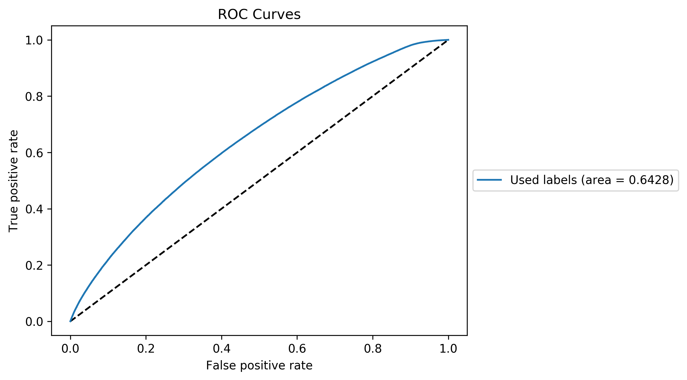

# Quark-Gluon Tagging with Machine Learning - ATLAS Experiment
## Meetings
### Recent progress: 
* Two massive datasets of about 3.6 M jets (quark + gluon) have been gathered. One with E_sub on constituents of 1 GeV and the other of 1/2 GeV. Both have the quark and gluon signals matched in energy distribution (they have the exact same energy distribution following that step). I have isolated an HDF5 jet table to run BDT's and DNN's, with 11 variables accessible:
    *  jetPt, jetEta, jetPhi, jetMass, jetE, jetWidth, 
    * jetEMFrac, jetChFrac, 
    * jetNumTrkPt500, jetNumTrkPt1000, jetSumTrkPt500
    
* To use such massive databases, I have developed a chunk-approach to the JUNIPR dataset. Each dataset is separated into chunks of recorded size. In the JuniprLargeDataset definition, based on the index (going from 0 to the total number of events available), it will either read the data from the chunk in memory or load a new chunk and place it in memory. This means a single chunk is kept in memory at a given time. I have not taken the time to make this system run with parallel processing as it is very difficult to manage shared information in this way (it could easily lead to erroneous behaviour where two parallel processors read different files and hence they keep loading new chunks, an expensive process.). The system has been checked to work as expected. There is a non-negligible overhead due to I/O of the chunk data but this is unavoidable (in fact, I have checked that CONDOR could not manage having the quark and gluon full datasets opened at once). 

    * I have cut the data for the E_sub 1/2 GeV  into two chunked version: one random (any energy) and the other one by energy. The idea is to use the first one for global training and the second one to isolate an energy range for training.
    
    * I have trained DNN on the HDF5 data and the 11 variables listed above. On the left is the ROC curve of a model with 2 32-unit hidden layers, with a weight decay of 0.0001 (L2 regularisation) , trained for 20 epochs. On the right is a model with 2 64-units hidden layers, with a weight decay of 0.0001 (L2 regularisation) trained for 40 epochs. 

* I have finished running different iterations of unary and binary JUNIPR's. All binary versions that have finished training were on the E_sub 1 GeV dataset. Clearly, the models have their performance saturated. The AUC they obtain is slightly lower than that previously managed on the MultiJet sample (it was around 0.732): this is surely due to the energy matching removing some difference between the two jet families. 
    

    
    
    

* Here is the result for the BDT that was found to be optimal on the MultiJet sample (n_estim = 300, lr = 0.15, and depth 3). Here also the AUC is lower than before, with the same likely explanation.

* Now the disappointing result is that binary JUNIPR trained on similar data (with E_sub 1 GeV) is performing significantly worse. On the left is a binary JUNIPR using unaries trained for 6 epochs and on the right using unaries trained for 16 epochs (there is some variance in the result so the difference is not significant). Clearly not optimal: what follows is a long list of experiment ran to try to understand why it is performing in such underwhelming manner. 

* The first thing I should mention is that the JUNIPR models used above were fully trained (even 6 epochs was sufficient given just how large the dataset is now, with 1.8 M jets for each label). Here are the training curves of the two unaries (gluon left, quark right) that were trained for 6 epochs (note that the other version trained then for 10 more epochs and nothing improved: they are clearly at saturation):

    

* And here are the loss (left) and accuracy (right) curves for the binary JUNIPR using this info: 

    

* Clearly, every one of them is at saturation. "Worse" than this, the unaries are in fact learning their data distribution very well. Each pair of plots that follows has gluon left and quark right. 
    * end:
    

    
    
    
    

    * mother index:
    

    
    
    
    

    * z:
    

    
    
    
    

     * theta:
    

    
    
    
    

    * phi:
    

    
    
    
    

     * delta:
    

    
    
    
    

* The fact the models failed to deliver nice results is therefore not just a question of training. But surprisingly  the first result I had this week was extremely good. Running on a much smaller dataset (700k jets in total for both labels), no E sub cut and no energy matching, I had the following binary JUNIPR result (50 epochs training of unaries and 26 epochs training of binary)

* Here is the catch: the lack of energy matching between the quark and gluon. I believe it removes a lot of what the model uses to classify. Testing this model on the data with E sub 1 GeV and energy matching, the result obtained is far worse (left plot). On the contrary, testing the model that ran on 1 GeV E sub with energy matching on this smaller dataset, the result improved vastly (right).

    
 
 * I tried to improve the result in three ways (keeping the energy matching since removing it gives a useless scenario):
    * I generated the E sub 1/2 GeV dataset to check if it is the E sub 1 GeV that removes too many constituents and therefore decreases what JUNIPR can do to separate quark and gluon jets. It seems in fact that it is worse than before so it might rather be a problem of too many poor quality nodes. 
    * I chunked the data (E sub 1/2, in light of the previous result, I am going to do this for E sub 1 GeV too) in energy bins (by units of 100 GeV, up too 500 GeV which includes everything above). I am training models on the 100-200 GeV bin to see if it learns better. For the moment, the result does not suggest any improvement: in fact quite the opposit. This might be due to the fact the sample size is much smaller, at about 500 k jets in total - though the phase-space section is much more narrow.
    * I am running models with an increased architecture (hidden state size 30 -> 40 with all DNN have a 20-unit hidden layer instead of 10-unit one).
    
* I am not sure that JUNIPR will end up winning here. In fact, there are several reasons I think it is badly performing:
    * It uses calorimeter cell constituents. I have observed that the sum of their energy is quite different from the jet energy. Clearly the jet variables gathered by athena have a higher degree of processing involved to construct them. Another issue with this is that it might be more sensitive to pile-up (the only thing that attacks PU is the cut removing jets not coming from the PV). 
    * The BDT and NN do still learn from the underlying process distribution. Even if the energy is matched, there is still some distribution of information that is different between the two sets of jets. For example, here are the pT distribution (gluon left, quark right). Matching in energy does not mean the whole signal is blind from the underlying physical process distributions. This means the NN and BDT models actually perform a slightly different taks than junipr: they are tagging quark and gluon based on global distributions while JUNIPR is tagging based on quark and gluon jet structure. The information content is not the same, hence the difference. 
    

    
    
    
    
    
    * Comparing to the JUNIPR paper, it uses a very different type of information. Calo-cell momenta have no mass, yet the input of the network are four-momenta with (energy, theta, phi, mass). Hence final state constituents have a useless variable (the mass is not null for intermediate state constituents). Also, given they are calo cells, the theta phi values it takes may actually just cover the entire jet energy deposit. THis means the angular information is not that granular compared to final state <b>particles</b>. These problems are unavoidable when working at the low-level. 
    
    * Another subtlety of the JUNIPR paper: I do not believe they chose the energy bin 450-550 GeV by accidents (in the binary it's 500-550 GeV). Such large values of energy means they are studying larger jets on average than I do. I have:
        * 1M jets below 100 GeV,
        * 350 in [100, 200] GeV, 
        * 200k in [200, 300] GeV, 
        * 75 k in [300, 400] GeV,  
        * 40 k in [400, 500] GeV, 
        * 63 k above 500 GeV. 
        This means that on average my jets are far far far less energetic than theirs and thus probably much shorter. As soon as it finished training, I am going to have a look at the performonce on each of these bins (problem is that some are not much populated). It may be too hard for JUNIPR to work with small jets. In fact, JUNIPR performance might be directly correlated with the energy given the impact this variable has on the size of the tree. It is not something they mentioned in their paper. Neither did they show the energy distribution of the jets they used ... it might be that on their short range, the two signals are quite different. 
        
* Whatever the final result, it at least shows that JUNIPR is capable of tagging based on low-level input (even though the performance is not as astonishing as claimed in their paper).
        
[Notes on meetings.](https://docs.google.com/document/d/1mPCNGwLqUHwPWRzEXwxDVAvANspSMXEBrSzKO49E8Ds/edit?usp=sharing)

## Readings
[Temporary bibliography.](https://docs.google.com/document/d/1T0P84bvZvcEdx9cvs6z_uXsKWNDNlzjyWbvqWfU1s5I/edit)

[Note on Readings.](https://docs.google.com/document/d/1u7orIhStgtNy6GY1Ix_eOC2UjRiMTey7CkkDW5u7Oxg/edit?usp=sharing)

## Work
[Notes on Work Progress.](https://docs.google.com/document/d/1REFWLDmTNmnLVJMIwqeWt13o8EeNrBTAoQybtgy6I2A/edit?usp=sharing)

[Experiment Log.](https://docs.google.com/spreadsheets/d/1Yu8Fxa3OA3b5M0SDpXkCFffr_e0Qvg-HA2QqpyZvl-I/edit?usp=sharing)

PyTorch should be appropriate to implement all considered network implementations and exploit GPU's. In particular:
* Convolutional Neural Network ([CNN](https://pytorch.org/tutorials/beginner/blitz/cifar10_tutorial.html))
* Recurrent Neural Network ([RNN](https://pytorch.org/tutorials/intermediate/char_rnn_classification_tutorial.html))
* Variational Autoencoders ([VAE](https://pyro.ai/examples/vae.html))
* Generative Adversarial Networks ([GAN](https://pytorch.org/tutorials/beginner/dcgan_faces_tutorial.html))

A larger list of tutorials for [PyTorch](https://pytorch.org/tutorials/). 

A general tutorial on EventLoop is accessible [here](https://twiki.cern.ch/twiki/bin/viewauth/AtlasProtected/EventLoop#Grid_Driver) but requires a CERN account.

A tutorial on how to use Athena and the ATLAS codebase to analyse the xAOD files can be found [here](https://atlassoftwaredocs.web.cern.ch/ABtutorial/alg_basic_intro/).

An ATLAS dataset browser is available here [AMI](https://ami.in2p3.fr) and requries a CERN account as well as some certificates. 

A short explanation on variables is available [here](https://twiki.cern.ch/twiki/bin/viewauth/AtlasProtected/Run2JetMoments) but requires a TWIKI access. 

The [JUNIPR framework](https://arxiv.org/abs/1804.09720) is implemented on [this github page](https://github.com/andersjohanandreassen/JUNIPR)

