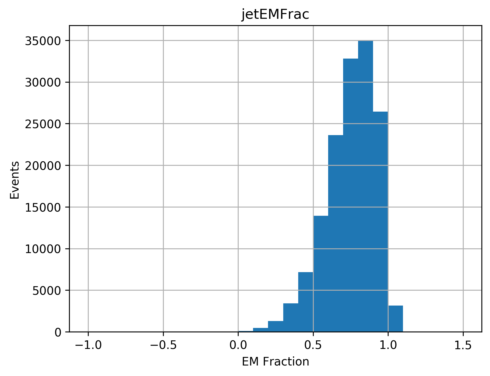

# Quark-Gluon Tagging with Machine Learning - ATLAS Experiment
## Meetings
### Recent progress: 
* Granular data gatherer: thanks to Aaron's tremendous help, the algorithm now runs and collects (almost) all the data required. The only small things missing are some variables that were present in past versions (mostly: jetTrackWidthPt500, jetTrackWidthPt1000,  jetSumTrkPt1000, and jetHECFrac - note that the width of the jet is now somewhat accessed by a different variable).
    * In particular, the truth infomationis now accessible
    * Regarding submission to the grid, the issue is not yet resolved and Aaron is working on this (he received an example of steering macro for the grid that he thinks might work better since we still do not understand the issue)
* GranularUprootTransformer (in DataLoaders): code to process the tree given by the granular gatherer into two things
    * A pair of dataframes (for constituents and jets) stored as h5 + diagnostic plots (see below)
    * A json file containing a dictionary of junipr jets 

* The later is obtained by processing the constituent and jet dataframes with JuniprProcessing (in DataLoaders). Several stages are involved
    * The first stage is to gather the constituent info (in a panda dataframe) into a per jet event
    * This is then translated into a numpy sequence (one for each jet) that is processed using the PyJet library
    * This library implements a (simplified) version of the FastJet algorithm for python
    * The output is a clustering sequence (general enough to work with any clustering algorithm, anti-Kt for now)
    * This sequence is accessed to gather junipr like information about the event into a dictionnary. In particular:
        * a list of constituent momenta in the system (energy, theta, phi, mass) is set up (coordinate system focus on the global jet direction)
        * a list of branching (a pseudo particle decays into two sub particles) is returned and each branching is parametrised as in junipr (z, theta, phi, delta) with:
            * z fraction of energy of soft daugther (right now, the one of least energy ... is this right or should it be the one of least pT ... they take energy)
            * theta: angle between mother and soft daughter
            * phi: angle of the plane of the decay with respect to a fixed orientation (detector y axis) and the mother
            * delta: angle between mother and hard daughter
    * The result has been checked for consistency and seems to match the format of junipr data
    
* Some information (called diagnostic) can be produced by the GranularUprootTransformer. It indicated a few interesting elements.
    * A spurious behaviour was uncovered: there is a peak around 3 constituents per jet in the non-cut data. Aaron indicated this looks like muon contamination (cutting jets with less than 4 constituents is in fact a good cut against them). To safeguard against bad cases, three cuts were added removing:
        *  jets with pT < 20 GeV. 
        *  jets with a truth information that is neither quark (1) nor gluon (0)
        * jets with less than 4 constituents
    * Global effect of the cut
        * Jet tables goes from 482,797 to 147,388 entries  (reduction factor: 30.5% )
        * Constituents tables goes from 6,001,431 to 2,361,307 entries (reduction factor: 39.3%)
    * Left: the number of constituents per jet.. Right: the number of constituents per jet WITH cuts.
    

    
    
    

    
    * Left: jet ID. Right:  jet ID WITH cuts (all next have the cuts).
    

    
    
    

    
    * Left: delta R of constituents to jet. Right: jet EM fraction.
    

    
    
    

   
   * Left: jet phi . Right: constituents phi. Interesting case for the constituents: could it be due to the structure of the detector (cylinder detector, most cell could be aligned along given radius and hence focus at given values of phi)? The asymmetry of the right plot seems to be explained by the left one: in this sample, more jets had a positive phi. 
   

   
   
   

   
   * Energy of the jet (left) and constituents (right), both in logscale
   

   
   
   

   
    * Energy difference (Jet - sum of constituent energy) and px difference (same idea), both in logscale
    

    
    
    

    
    * There are some jets that have a large energy difference compared to the sum of their constituents. This has already been somewhat corrected compared to the no cut case. Left is the energy difference without cuts and right with cuts (as above)
    

    
    
    

    
    * To investigate, I tried a more conservative jet cut (as above but removing events with less than 6 components) shown right here (left is the 4-component cut) which slightly improved things but not by a lot. 
    

    
    
    

    

[Notes on meetings.](https://docs.google.com/document/d/1mPCNGwLqUHwPWRzEXwxDVAvANspSMXEBrSzKO49E8Ds/edit?usp=sharing)

## Readings
[Temporary bibliography.](https://docs.google.com/document/d/1T0P84bvZvcEdx9cvs6z_uXsKWNDNlzjyWbvqWfU1s5I/edit)

[Note on Readings.](https://docs.google.com/document/d/1u7orIhStgtNy6GY1Ix_eOC2UjRiMTey7CkkDW5u7Oxg/edit?usp=sharing)

## Work
[Notes on Work Progress.](https://docs.google.com/document/d/1REFWLDmTNmnLVJMIwqeWt13o8EeNrBTAoQybtgy6I2A/edit?usp=sharing)

[Experiment Log.](https://docs.google.com/spreadsheets/d/1Yu8Fxa3OA3b5M0SDpXkCFffr_e0Qvg-HA2QqpyZvl-I/edit?usp=sharing)

PyTorch should be appropriate to implement all considered network implementations and exploit GPU's. In particular:
* Convolutional Neural Network ([CNN](https://pytorch.org/tutorials/beginner/blitz/cifar10_tutorial.html))
* Recurrent Neural Network ([RNN](https://pytorch.org/tutorials/intermediate/char_rnn_classification_tutorial.html))
* Variational Autoencoders ([VAE](https://pyro.ai/examples/vae.html))
* Generative Adversarial Networks ([GAN](https://pytorch.org/tutorials/beginner/dcgan_faces_tutorial.html))

A larger list of tutorials for [PyTorch](https://pytorch.org/tutorials/). 

A general tutorial on EventLoop is accessible [here](https://twiki.cern.ch/twiki/bin/viewauth/AtlasProtected/EventLoop#Grid_Driver) but requires a CERN account.

A tutorial on how to use Athena and the ATLAS codebase to analyse the xAOD files can be found [here](https://atlassoftwaredocs.web.cern.ch/ABtutorial/alg_basic_intro/).

An ATLAS dataset browser is available here [AMI](https://ami.in2p3.fr) and requries a CERN account as well as some certificates. 

A short explanation on variables is available [here](https://twiki.cern.ch/twiki/bin/viewauth/AtlasProtected/Run2JetMoments) but requires a TWIKI access. 

The JUNIPR framework is implemented on [this github page](https://github.com/andersjohanandreassen/JUNIPR)
