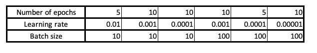

# Quark-Gluon Tagging with Machine Learning - ATLAS Experiment
## Meetings
### Recent progress: 
* I have corrected a lot of bugs in my implementation. By order of importance:
    * I realise I was feeding a lot of garbage to the network because I was using the scaling functions proposed by JUNIPR. This had the effect of erasing a lot of information as many of the variables I was trying to scale between 0 and 1 were out of the range. It was very detrimental for the daughter branch as the value there gets discretised and if it falls out of the range, it crumbles to either 0 or 1. I did not realise that this was in fact extremely common and happened a lot of time for a given event (the fact I tried to modify the scaling parameters to accomodate more of my data was not sufficient). I therefore got rid of the JUNIPR scaling and developped my own, as explained below. 

    * I have fixed the mother branch: the cross-entropy has to be taken with respect to the x possible mother available at the time step studied. So if at the given timestep, there are 10 possible mothers (10 particles existing at the step in the tree, even final states particles), you have to output a score for these 10 entries to predict which will decay (in an energy order list: 1st entry: you predict it's the most energetic | 2nd entry: you predict it's the second most energetic |  ....   | 10th entry: you predict it is the least energetic). Before: it was considering the wrong number of particles (it was using the padded value, since for the RNN you pad the number of mothers). Now, it should see the right info (by making the associated tensor lower triangular and setting the upper triangular part to -inf so that it does not contribute in the softmax step). I have checked that this behaves as expected now. 
    
    * I had missed something with the binary objective JUNIPR implemented (for my defense, they never mentioned it in the paper). They took the binary cross entropy of sigmoid[log(P(Jet | Quark)) -log(P(Jet | Gluon))] with the truth label (1 for quark, 0 for gluon). I also noted they spent the 10 last epochs trying to optimise the AUC with: "Binary Junipr parameters were decided upon by evaluating the AUC (area under the ROC curve) on the validation set 10 times per epoch and choosing the model that achieved the maximal AUC during the final 10 training epochs." 
    
    * Small inconsistencies on what loss was propagated: sometimes it was batch loss, sometimes it was the batch loss averaged over the batch size. From now on, is the latter. 

* Before fixing this, I ran three binary trainings, each time for 20 epochs and using the 50 epochs-trained unary junipr on 300k jets for train+val+test of the old architecture (meaning simple RNN cells with hidden state of size 10 3 MLP of 10 units in a single layer for daughter, mother, and ending branch). The model still had all the bugs above that are now fixed. The bugs + the vastly underpowered architecture + the small dataset for large phase-space are important to note: incredible performances are not to be expected. It is only a gauge of whether the model is already doing something smarter than random guessing. The most promising implementation was the one using the fixed objective binary cross entropy of sigmoid of ratio with used labels. Remember that the used labels is the truth label when it 0 or 1 and the dataset label when the truth is -1 (the dataset label is 1 for ttbar and 0 for dijet). 
    * What follows is the ROC curve for the good labels (restricting the data to samples having a truth label of 0 or 1, shown left) and the used labels (right):

    

    
    
    

    * And here are the associated confusion matrices (using a threshold of 0.5) with good labels left and used labels right:
    
    

    
    
    

    * Clearly, the result is not good (AUC for NN and BDT reached about 0.73 and they reached 0.899 for the binary JUNIPR paper on a very specific dataset) but as mentioned above this is somewhat expected (actually a good sign for a network having a badly implemented branch and blurred data). The somewhat positive news is that it is doing better than random guessing . This motivated an intense re-reading to correct bugs and implements some improvements.
    
* Here are the ameliorations I implemented: 
    * I implemented a whole new scaling function using the properties of the function <i>log( 1 + alpha X variable) / log(1 + alpha X expected_limit)</i> where <i>alpha</i> is a parameter controling the curvature of the scaling (how steep it goes from the start), <i>expected_limit</i> is the expected upper limit of the <i>variable</i>. This function scales the <i>variable</i> from the range [0, <i>expected_limit</i>] to [0, 1] and accepts overflow (though they will very slowly depart from 1). Negative values are not accepted (except if alpha X variable is above -1). I have checked that none of my signals are negative on a batch of 400 items (so I'd say it is very unlikely). I selected the values of <i>alpha</i> and <i>expected_limit</i> based on the plots I have of the dijet and ttbar processes (the values chosen are the same for the two process of course). Implementing these transformation, I did not observe any overflow (nor underflow) for the daugther branch (the one that gets discretised and for which being out of the range means loosing some information). There were a few cases where the mass and energy of momenta were above 1: not an issue as this does not get discretised and is always very closet to 1 (never more than 2) so very little parametric shift is endured. 
        * Branching <i>z</i> scaling: the range is [0, 1/2] (since fraction of energy of the lowest daughter, cannot exceed 1/2). Alpha was chosen to have more weight at the intermediary values of 0.2 to 0.4 (I observed most of the data had such values). This is the scaling function:
        

        
        

    
        * Branching <i>delta</i> scaling: the range is [0, , pi] (maximum angle between two particle is naturally pi). Alpha was chosen to have more weight at the very small values of 0 to 0.02 (most of the data had such values: logical since this is the angle between the mother and the hardest daughter, which has to be the one most aligned to the mother by energy-momentum conservation). This is the scaling function:
        

        
        

    
        * Branching and momenta <i>theta</i> scaling: the range is [0, pi] (maximum angle between two particle is naturally pi). Alpha was chosen to have more weight at the low values of 0 to 1 (most of the data had such values). This is the scaling function:
        

        
        

    
        * Branching and momenta <i>phi</i> scaling: this one is an excpetion. The range is indeed restricted to [0, 2 X pi] and every value is (roughly) equiprobable. This is therefore linearly scaled to [0, 1] by diving the variable by 2 X pi.
    
        * Momenta <i>energy</i> scaling: there is no natural upper limit since I did not restrain my data in energy. So theoretically it is [0, infinity[ but in practise observing the distribution of constituent energy, it is very unlikely to have something above 700 GeV (first plot below). I therefore used the set [0, 700] GeV. Alpha was chosen to have more weight at the low values of 0 to 200 (most of the data had such values). First is the <b>constituent</b> energy distribution (dijet left, ttbar right) and second is the scaling function:
        

        
        
        

        

        
        

    
        * Momenta <i>mass</i> scaling: same problem as for energy. I used the set [0, 50] GeV. Alpha was chosen to have more weight at the low values of 0 to 30 (most of the data had such values). First is the <b>jet</b> mass distribution (dijet left, ttbar right) and second is the scaling function:
        

        
        
        

        

        
        

    * To improve the efficiency of the models learnt, I implemented both a learning rate schedule and a batchsize schedule. Options are to use the ones the JUNIPR paper followed or self defined versions. 

* I have been running a quark and gluon models on the full data I have. The data has been processed to be made of an equal number of purely labeled jet. This means that the dijet data is now cut to be made solely of gluon jets (label 0) and the ttbar one made of pure quark jets (label 1). This makes the global task easier and is comparable to what they used in the JUNIPR paper (will make it possible to compare with their result). To make sur little bias was endured, I further cut the dijet dataset to have as many jets as the ttbar.  This leaves me a total of 476,686 jets of each label of which 381,328 are used for training (this is somewhat comparable in number to JUNIPR although they restricted to a specific energy window). I have been running on this dataset, that I call it <i>full balanced</i>, to train a quark and a gluon models. I have also increased the padding size to 120 (to avoid cutting events with large number of constituents). The architecture was slightly changed: it now uses a LSTM cell of hidden size 30. To initiate its hidden state, a simple 10 hidden-unit MLP model is used to map seed_momentum to a first hidden_state. A similar MLP (not the same!) is used to map seed_momentum to an first cell_state (LSTM use two pieces of hidden information). The rest of the network has changed much except for the daugther branch. Instead of a single MLP predicting the 4 * granularity values of the branching (granularity being the number of bins used in the discretisation of the variables in the range [0, 1]), there are now 4 MLP's of 10 hidden units. 
    * The one for z received the hidden state of the LSTM and the mother momentum. 
    * The one for theta received the same info + the bin of z. 
    * The one for delta received the same info as the one for theta + the bin of theta. 
    * The one for phi receives the same info as the one for delta + the bin of delta (so the branching likelihood is in fact further parametrised by each variable).

* To follow the steps of JUNIPR, I am using a learning rate schedule as follow:

* This has already been training for two days (expected to reach the end tomorrow). Here are the learning curves for the gluon (left) and quark (right) models so far:

* To improve the accuracy of the study, I have already started collecting more data. I have doubled my amount of ttbar jets (downloaded myself more data files) and have already processed them into junipr jets. I have reprocessed the dijet (old one) + global ttbar (old+new) with an additional cut inspired by JUNIPR: I know remove any final state constituent that has an energy below 0.5 GeV (this occurs before the numbe of constituent cut so this may remove some jets too). This is a sanity check: node are not preferentially weighted in the likelihood of the tree. Hence, nodes with constituent of such low energies (that may easily be poorly described given how small their energy is) might be poorly described and reduce the accuracy of the model. The JUNIPR paper used a cut of 1 GeV, so mine not very strong. In fact, I notice that for the dijet dataset, this removes 5 jets on a set of 916,786 (so only but 0. 000545 % of them) and 336 constitutents on a set of 13814783 (so only but 0.00243 %). Perhaps I should move to a 1 GeV cut. I have previously tried a 0.5 GeV cut combined with a delta R to jet of at least 0.1 (I had the impression that it is what JUNIPR did): this was very bad as many jets were no longer reconstructed as a single jet (the R cut at the effect of removing the core) and I have thus discarded this set. I am also trying to increase my dijet set but this requires more care and Aaron is working on getting a sample without the strange peak observed last week (see next point). 

* Last week, we observed that the pT and energy distribution of the dijet dataset showed two peaks: one focus close to 0 and one at higher values (400 GeV for pT and 500 GeV for energy). Indeed, here are for the dijet sample the pT (left) and energy (right):
    

    
    
    

    
    * As discussed last week, I analysed the issue by implementing some further cut. Isolating quark jets energy (left) and gluon jets energy (right) showed that quarks are overly represented in this secondary peak:

    

    
    
    

    * This is also visible when adding a pT cut removing events below 300 GeV. Indeed, here are how the sample is populated before (left) and after all cuts (right):
    

    
    
    

    * Aaron agrees that this is due to the samples he downloaded coming from different slices in pT. He is working on getting a sample that is not biased. Once ready, I'll process it into JUNIPR jets.  

* I have analysed the mis-reconstructed jets during the JUNIPR processing (feeding a set of particles that have been reclustered into a single jet using anti-kT algortihm with radius 0.4 to tha C/A algorithm with radius 0.5). These are specifically the ones coming from the full data (dijet + ttbar) with the E_sub cut of 1/2 GeV (so constituents with less than this are removed). What follows are an example of two eta-phi maps of constituents and how they are reclustered (based on the marker with the black marker indicated the reconstructed jet, the other colour indicates energy of constituent):
    

    
    
    

* These two maps indicate the two limit scenarios: either the jet is globally reconstructed with a small number of forgotten components (left) or it is cut into several well furnished jets (right). To study the prevalence of each scenario, I analysed all miss-reconstructed jet for dijet, ttbar and the new ttbar dataset with the E_sub < 1/2 GeV cut. The result is summarised in the next histogram that displays the count for size of largest and smallest jet reconstructed (all cases add two jets reconstructed, never more):

[Notes on meetings.](https://docs.google.com/document/d/1mPCNGwLqUHwPWRzEXwxDVAvANspSMXEBrSzKO49E8Ds/edit?usp=sharing)

## Readings
[Temporary bibliography.](https://docs.google.com/document/d/1T0P84bvZvcEdx9cvs6z_uXsKWNDNlzjyWbvqWfU1s5I/edit)

[Note on Readings.](https://docs.google.com/document/d/1u7orIhStgtNy6GY1Ix_eOC2UjRiMTey7CkkDW5u7Oxg/edit?usp=sharing)

## Work
[Notes on Work Progress.](https://docs.google.com/document/d/1REFWLDmTNmnLVJMIwqeWt13o8EeNrBTAoQybtgy6I2A/edit?usp=sharing)

[Experiment Log.](https://docs.google.com/spreadsheets/d/1Yu8Fxa3OA3b5M0SDpXkCFffr_e0Qvg-HA2QqpyZvl-I/edit?usp=sharing)

PyTorch should be appropriate to implement all considered network implementations and exploit GPU's. In particular:
* Convolutional Neural Network ([CNN](https://pytorch.org/tutorials/beginner/blitz/cifar10_tutorial.html))
* Recurrent Neural Network ([RNN](https://pytorch.org/tutorials/intermediate/char_rnn_classification_tutorial.html))
* Variational Autoencoders ([VAE](https://pyro.ai/examples/vae.html))
* Generative Adversarial Networks ([GAN](https://pytorch.org/tutorials/beginner/dcgan_faces_tutorial.html))

A larger list of tutorials for [PyTorch](https://pytorch.org/tutorials/). 

A general tutorial on EventLoop is accessible [here](https://twiki.cern.ch/twiki/bin/viewauth/AtlasProtected/EventLoop#Grid_Driver) but requires a CERN account.

A tutorial on how to use Athena and the ATLAS codebase to analyse the xAOD files can be found [here](https://atlassoftwaredocs.web.cern.ch/ABtutorial/alg_basic_intro/).

An ATLAS dataset browser is available here [AMI](https://ami.in2p3.fr) and requries a CERN account as well as some certificates. 

A short explanation on variables is available [here](https://twiki.cern.ch/twiki/bin/viewauth/AtlasProtected/Run2JetMoments) but requires a TWIKI access. 

The JUNIPR framework is implemented on [this github page](https://github.com/andersjohanandreassen/JUNIPR)
