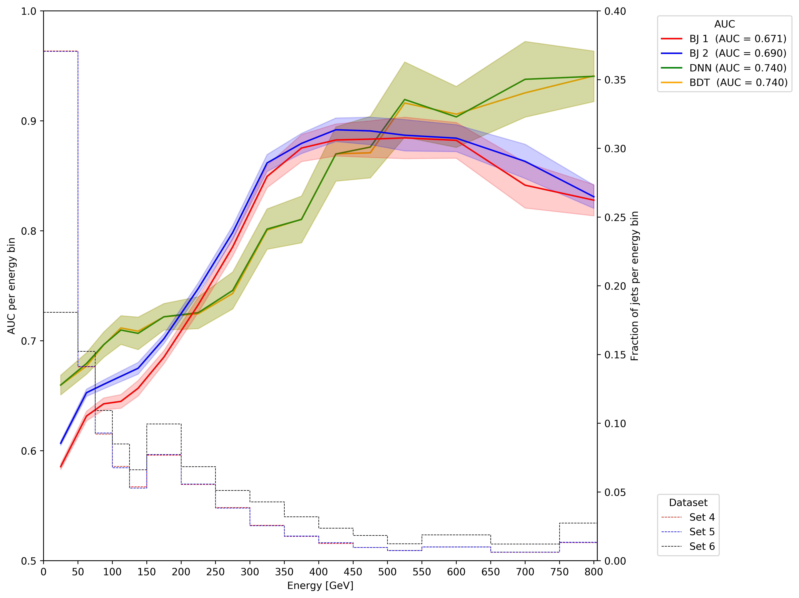

# Quark-Gluon Tagging with Machine Learning - ATLAS Experiment
## Meetings
### Recent progress: 
* I have collected a dataset of Truth jets (using pure simulations with real particles at the end).  The results seems similar to what has been observed before (training almost halfway through). 

* I have finished training several binary Junipr models. Here is a comparison of BJ 1 and BJ 2, the same network running respectively on dataset with E_sub of 1 and 1/2 GeV. Clearly, lowering the E_sub cut improves performance. It is however not enough to beat the BDT and DNN benchmarks. 

    

* I have uncovered an interesting effect: binary Junipr results are strongly correlated with the average energy of the jet samples they analyse. This is indeed shown in the next figure.

    

* This is in fact true of all discriminators studied here, as shown in the next plot that neatly summarises all big conclusions of the project. In straight curves is the evolution of the AUC (left y-axis) and in dashed the evolution of the normalised distribution of the number of jet per energy bin (each AUC is computed in an energy bin of a certain width to insure sufficient statistics). The shadded area around the AUC curve correspond to a notion of statistical incertitude ( +- 1 / sqrt[number of jets in the bin]).
    

    
    
    
    
  This plot is interesting for several reason:
   * It clearly shows the effect of going from high (set 6) to low level (set 4) variables with the dashed stepping curve. The energy of jets of set 6 is the high level one reconstructed with the ATLAS software and combining several part of the detector. The energy of jets of set 4 is a low-level measured by aggragating topoclusters cells (from the calorimeter) selected for clustering in Junipr. Given the correlation between efficiency and energy, this helps explain with Junipr has lower results. 
   * The strong correlation with energy of all models. Clearly, Junipr dominates in the energy region of [200, 500] GeV. When combining with the high-to-low shift, it implies that the binary Junipr result from the paper of 0.899 in [500, 550] GeV is almost reached here, BJ 2 reaching 0.891 in [400, 500] (there still is a difference in variable level + the problem of different processes used and different scaling + detector effect ... having the same value with the same network should be impossible). It is very interesting that they did not mention this extreme case in the Junipr paper: they literaly choosed the best bin to perform their experiment. The global lower performance of Junipr is understandable now: more of its jets are low energy and not in the energy region where it performs well. on the contrary, BDT and DNN have more high energy jets. 
   * Interstingly, the performance of Junipr saturates! It decreases for larger energies. This is a light conclusion, given there is a low amount of data at high energies but the tendency seems clear from a stastical incertitude point of view since  the last bin is clearly lower for BJ 2 while it keeps increasing for the BDT/DNN models. This saturation is extremely interesting since it suggests a competition between two different behaviours
    * A positive one, increasing energy. Probably the fact that for increasing energy, the bias introduced by poorly reconstructed nodes is neutralise by more nodes.
    * A negative one. I believe there might be two effect there:
        * this might be the effect that with higher energies and larger number of decays, there will be more low-energy particle that are poorly reconstructed. At a certain moment, this increase in low-energy particules dominates and starts shrinking the AUC by adding far more bad nodes than good nodes are introduced by the larger energies. 
        * The bad effect may however also just be an artifact of the smaller set of jets available at high energies. It would mean Junipr is not as comfortable predicting a label on high energy nodes and therefore, when high energy are reached, can no longer express a preference between quark or gluon. The decision would then be left at the hand of the low energy nodes that might suffer from noise ... hence the lower energy. 
        
* Note only does Junipr AUC increase with energy, but the confidence in the prediction itself increases:   
    * [0, 100] and [100, 200]

    

 * [200, 300] and [300, 400]

    

 * [400, 500] and [500, infinity[

    

  Note this last bin: its pattern is veyr similar to that of the previous bin. This gives the impression that the badly predicted jets (the quark in gluon region and vice versa) might just be due to the smaller set, hence the precaution on the conclusions regarding the higher energies. 

* I tried training a model on the [100, 200] GeV region (same network architecture as BJ 2), called BJ 3. In the same bin, BJ 2 outperforms it (while BJ 2 was not specifically trained on that bin). Either BJ 2 was able to use elements learnt in other energy bins to improve its efficiency in that bin, or BJ 3 cannot trained well enough with the size of the data sample it has. I rather doubt this last point given it has access to 347k jets in that bin for each label (so almost 700k jets in total).  

    

* Still running: 
    * A larger network on set 4 (30 -> 40 size of hidden state + 20 units in hidden layers of DNN instead of 10)
    * A regular network on truth information.
    * Collecting meta information on nodes to try to assess what's happening with bad nodes (look at their energy distribution, depth in the tree, ...)

[Notes on meetings.](https://docs.google.com/document/d/1mPCNGwLqUHwPWRzEXwxDVAvANspSMXEBrSzKO49E8Ds/edit?usp=sharing)

## Readings
[Temporary bibliography.](https://docs.google.com/document/d/1T0P84bvZvcEdx9cvs6z_uXsKWNDNlzjyWbvqWfU1s5I/edit)

[Note on Readings.](https://docs.google.com/document/d/1u7orIhStgtNy6GY1Ix_eOC2UjRiMTey7CkkDW5u7Oxg/edit?usp=sharing)

## Work
[Notes on Work Progress.](https://docs.google.com/document/d/1REFWLDmTNmnLVJMIwqeWt13o8EeNrBTAoQybtgy6I2A/edit?usp=sharing)

[Experiment Log.](https://docs.google.com/spreadsheets/d/1Yu8Fxa3OA3b5M0SDpXkCFffr_e0Qvg-HA2QqpyZvl-I/edit?usp=sharing)

PyTorch should be appropriate to implement all considered network implementations and exploit GPU's. In particular:
* Convolutional Neural Network ([CNN](https://pytorch.org/tutorials/beginner/blitz/cifar10_tutorial.html))
* Recurrent Neural Network ([RNN](https://pytorch.org/tutorials/intermediate/char_rnn_classification_tutorial.html))
* Variational Autoencoders ([VAE](https://pyro.ai/examples/vae.html))
* Generative Adversarial Networks ([GAN](https://pytorch.org/tutorials/beginner/dcgan_faces_tutorial.html))

A larger list of tutorials for [PyTorch](https://pytorch.org/tutorials/). 

A general tutorial on EventLoop is accessible [here](https://twiki.cern.ch/twiki/bin/viewauth/AtlasProtected/EventLoop#Grid_Driver) but requires a CERN account.

A tutorial on how to use Athena and the ATLAS codebase to analyse the xAOD files can be found [here](https://atlassoftwaredocs.web.cern.ch/ABtutorial/alg_basic_intro/).

An ATLAS dataset browser is available here [AMI](https://ami.in2p3.fr) and requries a CERN account as well as some certificates. 

A short explanation on variables is available [here](https://twiki.cern.ch/twiki/bin/viewauth/AtlasProtected/Run2JetMoments) but requires a TWIKI access. 

The [JUNIPR framework](https://arxiv.org/abs/1804.09720) is implemented on [this github page](https://github.com/andersjohanandreassen/JUNIPR)

